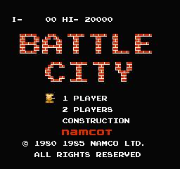
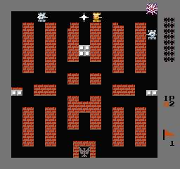

게임을 처음 접하게 된 사람들은, 대부분 주변인물들의 유혹(?)에 게임에 빠지게 되는 경우가 많았다

나도 마찬가지로 친척형이 데려간 오락실에서 잘 알지도 못하고 접했던 배틀 시티 (탱크라고도 불림)로 게임을 처음 시작하게 된 후로, 시간이 날 때면 오락실에 들려서 조금씩 게임을 즐기게 되었습니다. 우연인지, 필연인지 오락실이 집에서 2분거리였기때문에, 학교갔다오면서, 심부름갔다오면서 등등 하루에도 몇 번씩 수시로 오락실에 드나들게 됐다

인생 첫 게임이다보니 먼 훗날 패미컴을 사게 된 이후에도 자주 즐기게 됐던 게임이지만, 단순한 게임성에 다른 게임으로 점차 눈이 가기 시작한 것은 어쩔 수 없었나보다

그럼에도 내 인생 첫 게임이다보니 가산점을 줌