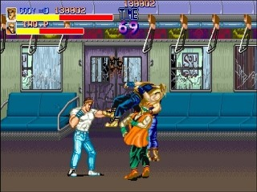
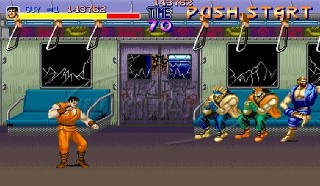
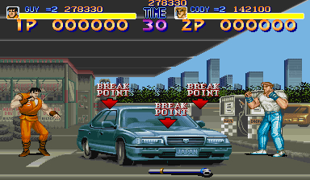

아직도 이름이 기억나는 집 바로 옆건물에 있던 명보 오락실에서 신종 게임을 들여놓는데에 열심히였다.

89년에 발매되고 몇 달 안되서 파이날 파이트가 들어오게 됐다.

당시엔 89라고 불렸는데,  이렇게 불리게 된 이유가 여러 가지로 추측됐다. 

1. 파이날 파이트의 발음과 89가 비슷해서
2. 89년도에 발매되어서
3. 원래 이름이 스트리트 파이터 89였기 때문에

도대체 어디서 그렇게들 알아냈는지, 따닥이라 불리는 두 번치고 반대편치고, 두 번치고 반대편으로 치는 기술과, 스테이지 2에서 상자위에 올라선 후 시간 때우는 방법 등이 주로 사용됐다. 

보너스 스테이지도 있는 등 기본적으로 게임 플레이 타임도 길고, 보스 패턴도 다양하고, 스테이지 구성도 다양해 80년대 말 게임임에도 불구하고 이미 벨트 스크롤 게임의 교과서를 썼다고 볼 수 있는 게임이었다.

당시 너무 많은 사람들이 이게임을 찾게되어, 보통 한 오락실에 2~3대 정도는 들여놓게 된다.