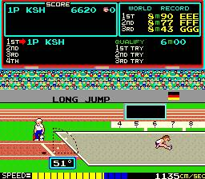
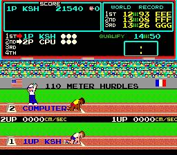

 많은 분들이 기억하시는 올림픽 게임인, 트랙 & 필드 (일명 88올림픽, =하이퍼 올림픽)도 오락실 한켠에 자리하고 있었다.

높은 난이도로 그리 자주 즐긴편은 못되었지만, 가끔 즐길 때면 굉장히 신나게 즐길 수 있는 게임이었다. 

버튼 연타가 중요한 게임이다보니 여러 가지 연타 방법이 사용되었는데, 동전으로 연타, 두손으로 연타, 손톱으로 연타 등등 수많은 기술들이 사용된 게임이기도 했다.

모든 종목이 고난이도인 편이지만, 특히나 투포환 던지기는 정말 어렵다.