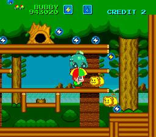
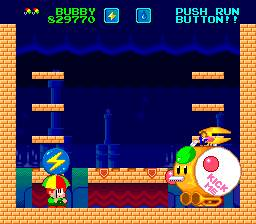

그 당시 오락실에서 볼 수 있었던 게임들은 파라솔 스타(PC엔진), 100가지 게임(패미컴)등등 게임기를 기판대신 넣은후 시간제로 게임을 즐기도록 하는 게임도 많았다.

게임에 익숙하지 않아서 게임을 잘하지 못했던 어린 시절의 나로선, 시간제 게임을 즐기는 편이 게임을 더 오래 즐길 수 있는 방법이었다랄까?

이후 중학생이 되어 PC엔진 에뮬레이터로 즐기곤했는데, 내가 하는걸 보더니 빠져 버린 큰 누나가 몇시간씩 플레이하느라 내게 좌절(누나의 컴퓨터 독점으로 인한)을 안겨준 게임이기도 하다.

이 게임도 속칭으로 불렸는데 파라솔 스타. 우산 또는 우산돌이라 불렀습니다.

