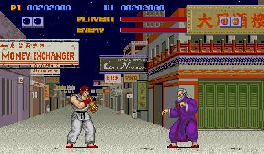
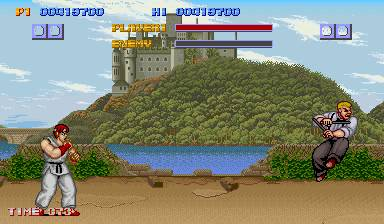

동네 오락실 한켠에 자리잡고 있던, 스트리트 파이터1은 당시의 유일하다고도 할 수 있는 격투게임이라는 점에서 주목을 받았다. 타격감이 좋았고, 각 캐릭터별 특성도 있어 꽤 인기를 끌었다.

커맨드 입력 개념의 도입, 3판 2선승제, 게이지 개념의 완벽한 구현등으로 인하여 높은 평가를 받기도 했다.

장풍을 비롯한 각종 판정이나 커맨드 입력이 직관적이지 않고, 점프 속도나 이동 속도도 이상하긴했는데, 그럼에도 대체제가 없었다.

류가 빨간 머리였다니?!? 2편부터는 염색하고 다닌걸까?
