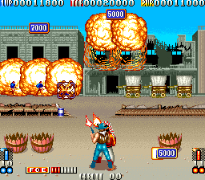
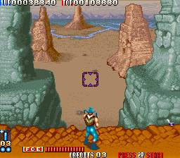

 오락실에 자주 드나들다보니 어떤 게임이 새로 들어오고 나가는지 잘 알 수 있었다. 재미있었던 점은 2~3년 이상 지난게임이 들어오는 일도 자주 있었고, 최신게임이 장사가 잘되는데도 없어지는 일도 있었다는 사실이다.

 오래된 게임이나, 장사가 잘 안되는 게임은 다른게임으로 바뀌는건 당연했다.

 보통 특정 게임을 제외하고는 발매된지 6개월~1년이 지난후에 들어오곤 하는게 보통이다.

발매한지 얼마 되지 않아 들어온 편에 속하는 블러드 브라더스. 건슈팅의 원조격으로, 재미는 있었지만 인기를 끌진 못했다.

그럼에도 나는 즐겨했고, 당시 체감형 건슈팅 게임이 없었는데, 이 게임이 건슈팅의 느낌을 어느정도 느낄 수 있게 해주는 액션 게임인 점은 좋았다.