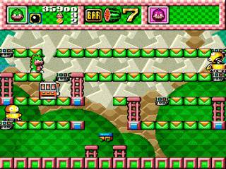
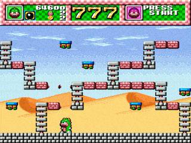

이 게임은 메가드라이브 게임인데, 나는 시간제로 아케이드에서 플레이 했었다.

게임 방식이 좀 특이했는데, 망치로 바닥을 쳐서 그곳에 빠진 적을 다시 망치로 쳐서 바닥으로 떨어뜨려서 없애는 독특한 방식이었다. 

적들의 스피드가 악어보다 빨라서, 바닥을 망치로 칠 수 없는 지역에서는 꼼짝없이 죽어야했는데, 이런 제약이 생각하는 플레이를 유도해서 좋았다.

또 화면 중앙 상단에 슬롯 머신이 보이는데, 슬롯 머신 아이템을 획득 할 경우 슬롯 머신의 결과에 따라 아이템이 우수수 떨어지게 되는 효과를 가져서 일확 천금을 노릴 수 있는 요소가 있었던 게임이었습니다.

[레트로 게임 월드 와니 와니 월드 리뷰](https://m.blog.naver.com/PostView.naver?isHttpsRedirect=true&blogId=laptick&logNo=220950888339)