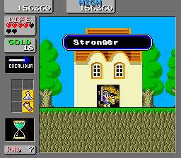
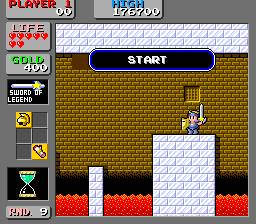

1990년 당시 파이날 파이트의 인기는 날이갈수록 더했고, 그러다보니 1시간은 기본으로 기다려야했다. 다들 실력도 늘고 시간 보내기 비기 등을 통해서 더 플레이 타임이 길어졌다.

기다리다 지쳐서 다른 게임을 대신 즐기는 경우가 많았는데, 그렇게 찾게된 게임이 `원더보이 인 몬스터 랜드`였다.

원더보이 인 몬스터랜드역시 여러 가지 비기가 존재했는데 보통 동전 흔들어 먹기와 보스별로 깨는 비법,각종 비밀상점등이 사용되었다.

오락실에서 즐기는 RPG 게임의 시초 같은 게임이었다랄까?

사실 꽤 어려운 게임이라 상점을 잘 활용하지 않고선 쉽지 않았다.

하지만 그 완성도가 훌륭해 아는 사람들은 다 아는 횡스크롤 액션 RPG의 정석같은 게임이다.