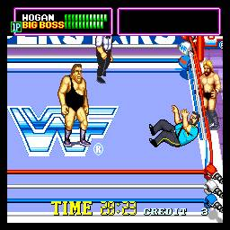
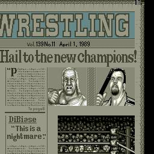

레슬링의 게임이었던 WWF 슈퍼 스타즈라는 게임은 당대의 스타인 헐크호간, 워리어, 빅보스맨, 달러맨, 자이언트, 마초맨등의 특징과 특기등을 제대로 구현해냈으며, 통쾌한 타격감등으로 많은 인기를 끌었지만, 승리를 거두고 다음 스테이지로 넘어가도 체력이 회복되지 않았던 것이 아쉬웠던 게임이었다.

당시 레슬링의 인기가 아주 좋았던 시기 중 하나다보니 레슬링 게임이 많았는데, 우리 동네에 들어왔던 게임은 이거 하나였고, 많은 선택을 받은 게임이다보니 관전의 재미가 있어 자주 지켜봤던 게임이다.

그래픽도 다른 레슬링 게임보다 깔끔했고 플레이 타임도 전반적으로 훌륭하지만, 나는 빠른 게임오버도 자주 당해 슬펐던 게임