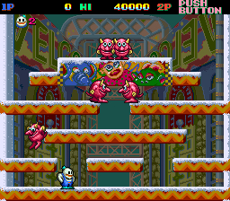
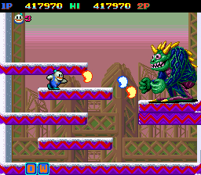

당시 동네 오락실에는 이상하게도 파라솔 스타즈와 레인보우 아일랜드가 있고, 버블버블이 없었는데, 그래서 새로 들어왔던 스노우 부르스로 사람이 몰렸고 나 역시 재밌게 즐기게 됐다.

게임 방식은 미사일로 적을 눈덩이를 만들어서 그 눈덩이로 다른적을 쓰러뜨리는 게임이었는데 아이템중 빨간 물약은 속도, 파란물약은 미사일의 파워, 노란물약은 미사일의 발사 거리를 상승시켜주었다. 
 
싹쓸이를 하면 만원짜리 지폐가 하늘에서 떨어지기 때문에, 싹쓸이를 노리다가 죽게 되는 일도 비일비재했다.
 
이런 스테이지식 플랫포머류 게임이 꽤 많이 나왔었는데, 단순한 조작과 쉽게 익숙해 질 수 있는 게임구성으로 게임을 잘 못하는 아이들도 오래 즐길 수 있다는 장점 때문에 많은 인기를 끌었던 게임이다.