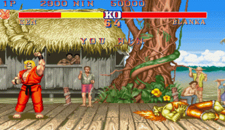
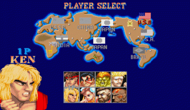
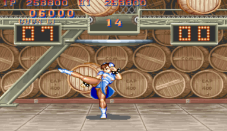
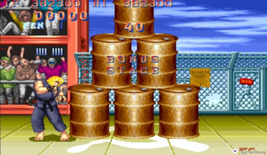
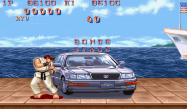

뛰어난 그래픽으로 주목을 받았던 이 게임은, 난입(게임 플레이 도중에, 코인을 넣고 서로 대전하는 것)이라는 특유의 문화를 만들어 나가며, 대전 게임의 기틀을 확립할 수 있었다. 

전작에서 시도되었던 커맨드 입력 시스템 체계를 바탕으로 캔슬의 개념도 만들어냈으며, 8명이라는 당시로선 놀랄 만큼 많은 캐릭터 숫자와 자칫 지루해질 수도 있는 격투게임에 전작에서도 선보였던 보너스 게임이라는 요소를 좀더 발전시키는등 초기의 격투게임이면서도 놀라울 만한 완성도로 격투게임의 전성기를 이끌 게 되고 많은 팬을 확보하게 된다.

90년대 초중반, 3D로 넘어가서는 2000년대 초반까지를 아우르는 격투 게임의 전성기의 효시라 해도 무방할 것이다.

류와 켄은 유사한 캐릭터긴 하지만, 동일 캐릭터 선택 불가를 감안한 선택이 아니었을까 추측된다.

혼다, 춘리, 블랑카, 장기에프, 가일, 달심등 캐릭터들의 특색이 뚜렷했으며, 점프 속도나 리치의 차이가 매우 다른 플레이 감각을 보여줬으며, 커맨드형 기술과 축적형 기술로 나뉘어진 규칙은 이후 커맨드 패턴을 정형화 하는 데에 일조했다고 볼 수 있다.

스트리트 파이터 1에서도 보너스 스테이지가 있었지만, 좀 더 재밌어진 보너스 스테이지는 중간 중간 쉬어가는 느낌이면서 즐거움도 주는 요소로 작용했다.

이 게임 때문에 오락실 주인이 되고 싶다는 생각을 한적도 있었을 만큼 재밌게 즐겼으며, 한 시대를 풍미한 전설이 된 게임이다.