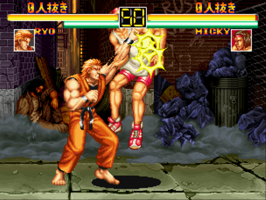
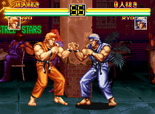

스트리트 파이터2가 폭발적인 인기를 끌던시기에, 용호의권이라는 게임이 등장했다.

사실 이 시기에 대전 액션 게임이 쏟아지던 시기였는데, 그 와중에 다른 게임들보다 좀 더 앞선 시기에 눈을 사로 잡는 그래픽으로 등장하게 됐다.

당시 내가 다니던 오락실에는 대전 게임을 모아둔 스테이지 같은 공간이 있었는데, 이 공간에 2대 (연결된 2대는 아닌 각각 2대)의 용호의 권이 등장했고 나도 유심히 지켜보게 됐다.

줌인 줌아웃, 초 필살기, 기 게이지 시스템등 여러 가지 시도를 했었다.

초 필살기인 패왕 상후권은 보너스 스테이지 중에서 골라 성공하지 못한다면 쓸 수 없는 기술이었다.

또 용호난무라는 필살기가 숨겨져 있었는데, 이 기술은 게임이 유행이 지난 한참 뒤에야 게임 잡지를 통해 알게 되기도 했다.

료와 로버트가 류와 켄을 연상시킨다는 점과, 너무 다운이 잘 되며, 기를 모을 시간이 잘 주어지지 않는 점과 기본기의 파워가 쎄서 사실은 필살기보다 더 중요하게 작용해 전반적인 게임 구도가 그렇게 흘러갔던 것은 SNK의 의도였는지 궁금하기도 했다.

가장 아쉬웠던 점은 스토리모드에서는 료와 로버트만 사용가능한 점이었는데, 같은 시기 스트리트 파이터2 챔피언 에디션이 선택 가능 캐릭터를 12개 까지 늘리는 방향이던 것을 감안하면 더욱 아쉬운 점이었다.