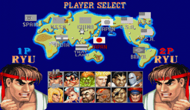
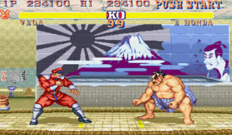

지속적인 인기를 끌던 스트리트 파이터2는, 사천왕을 직접 선택할 수 있고, 데미지 보정,일러스트 수정, 동일 캐릭터 선택 가능등의 기능을 추가한 Street Fighter 2 Champion Edition이 등장해서 사람들의 갈증을 해소해주었다.

당시 스트리트 파이터의 인기를 반영이라도 하듯이 수 많은 소문이 있었는데, 류와 춘리가 연인이다, 블랑카가 원래는 사람이었다, 사가트의 가슴의 상처는 류가 낸 것이었다, 발로그는 여자였다, 류의 직업은 백수인데 잘 먹고사는거보면 백수를 가장한 깡패라는 등등의 소문이 있었는데, 진실로 밝혀진 것도 있지만 허무 맹랑한 이야기 마저 나돌 만큼 인기가 많았다고 볼 수 있다.

이 버전이 출시된 이후, 오리지널 스파2는 대부분 뒷구석으로 밀려나게 됐으며 이후 해킹 롬을 포함한 다양한 버전이 파상되었음에도 스트리트 파이터2를 지칭할때 오리지널도 아닌 이 버전이 인정 받는 것은 그 완성도가 그만큼 훌륭했기 때문일 것이다.