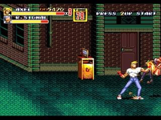
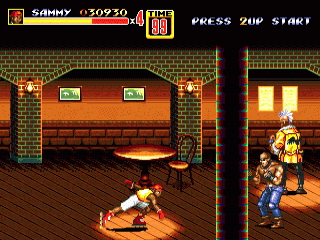

레인보우 아일랜드나, 악어나라처럼 시간제 게임이었던 베어너클2는, 파이날 파이트 스타일의 횡스크롤 액션 게임이었다.

펑키 재즈 느낌의 배경 음악과 효과음도 굉잫이 좋았고, 선명한 느낌의 아트가 어두운 분위기와 잘 어우러졌다.

4명의 캐릭터의 특색도 존재해서 다양한 캐릭터를 플레이하는 재미도 있었고, 파이널 파이트의 영향을 받은 측면으로 메가 크래시 (체력을 깎고, 일시 무적 판정으로 주변의 적을 모두 날려버리는 기술)가 도입되면서 벨트 스크롤의 정석을 잘 따른 웰메이드 게임이었다.