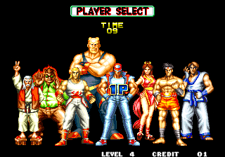
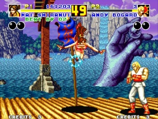

아랑전설2가 오락실에 들어온 날, 아랑전설2 주위는 하루종일 붐빌정도로 관심과 인기가 엄청났다.

당시 내가 가던 오락실에는 메인 게임 스테이지 코너가 따로 있고, 조금 구석진 곳들도 있었는데, 구석진 곳에 등장했음에도 병풍이 쳐질 만큼 사람들이 많이 모여들어 큰 관심을 샀다.

그 오락실에 아랑전설2가 들어온 것은 게임이 발매된지 꽤 지난후라, 초필살기 커맨드가 게임잡지등을 통해서 알려졌지만, 그것을 실제로 입력할줄 아는사람은 굉장히 드물었기때문에, 초필살기를 사용하는 사람이 등장하면 환호성이 터졌었다.

아랑전설2의 특징인 라인이동은 구석에 몰려서 빠져나올때나, 상대방의 기술을 피할 때 주로 사용되었는데, 시간 끌기용으로 활용되고 얍삽하다는 인식이 있어 자주 사용하거나, 자주 사용되는 것을 보진 못했다.

그럼에도 나름의 매니아층을 형성하는 데에는 성공해 비어있는 일은 별로 없었지만, 초반의 인기와 관심은 빠르게 사그라든 게임.