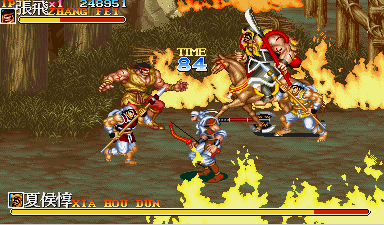
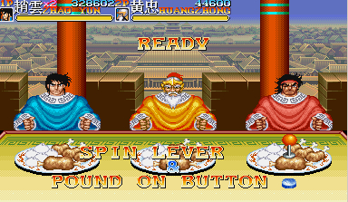

삼국지라 불렸던 천지를 먹다2는 관우,장비,조운,황충,위연이 등장하는 벨트 스크롤 게임이었다.

왜 천지를 먹다인지가 궁금했는데, 일본의 삼국지 소재의 동명의 만화가 있었다고 한다.

당시 어째서 위연은 있는데 오호대장군이었던 마초가 빠졌느냐는 원성을 듣기도 했는데, 뭐 굳이 오호대장군만 나와야 된다는 법은 없는 것 같기도 하다. 

말을 타면 각자의 고유무기(청룡언월도,사모등)를 사용할 수 있고, 캐릭터별 필살기와 다양한 무기(철퇴,도끼,망치,검,단도 등)가 등장했는데, 숨겨진 무기나 특정 무기를 획득 할 경우 아주 강한 공격력과 특성으로 좀 더 수월하게 스테이지를 클리어 할 수 있는 팁도 존재했따.

보너스 스테이지로는 음식 빨리 먹기, 1:1 대결등이 있었는데 익살 스럽게 음식 먹기를 하는 삼국지 캐릭터들이 유쾌해서 좀 더 재밌게 느껴졌던 것 같다.

다만 NPC가 너무 잘해서, 조금 힘겨웠던 보너스 스테이지였던 기억도 난다.