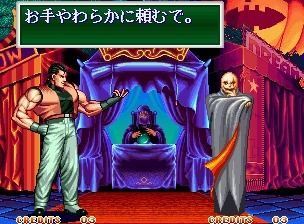
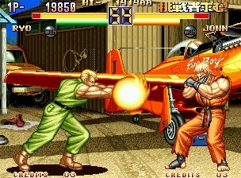

용호의권2는 전작보다 다양한 캐릭터로 게임을 진행할 수 있다는 점, 2P컬러를 직접 선택할 수 있는 것, 료와 로버트와 새로운 필살기가 생겼다는 것, 낙법(잡혔을 때 착지하기전에 작은 손을 타이밍 맞춰서 누르면 발동)을 사용할 수 있는 점 등이 차이점이었다.

오프닝에 나오는 기스를 보고, 아랑전설의 기스의 젊은시절 모습이다, 아니다 이름만 같을뿐이다 등등 여러 가지 소문이 있었는데, 기스는 직접 선택할순 없지만 한번도지지 않고 Mr.Big까지 간다면 기스가 등장했었다.

이 때 당시만해도 게임 잡지에서 다뤄지지 않은 이야기 들은 추측에 불과했는데, 아랑전설과 용호의권의 관계에 대한 추측은 재밌는 얘기거리가 되곤 했다.

사운드와 그래픽도 월등히 좋아졌으며, 기력 시스템의 번거로움이 여전하긴 했지만, 전반적인 조작감이 확실히 달라져 큰 인기를 끌었던 작품이다.

내가 당시 가던 오락실 기준 아랑전설 2보다 훨씬 인기가 많았으며, 스트리트 파이터 2 챔피언 에디션과는 비등한 수준이었다.