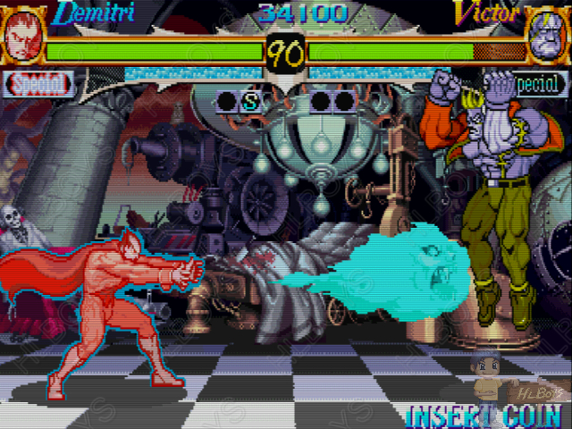
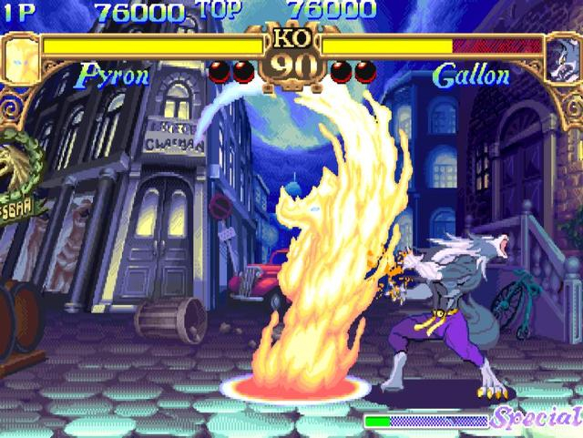

다크스토커즈는 뱀파이어, 늑대인간, 고양이 인간, 미이라,프랑켄슈타인등이 등장하는 이색적인 격투게임이었다. 
 
처음으로 공중가드가 다크 스토커즈에서 생겨났고, 아랑전설에서 처음 도입되었던 초필살기 시스템은,기 게이지가 찬 상태에서 필살기를 사용하면 자동으로 기존 필살기가 파워업이 되어서 스폐셜 필살기가 나가는 시스템을 채용했다. 

대쉬를 할 때 몇몇 캐릭터는 이전 게임에서 볼 수 없던 독특한 대쉬 (예를 들어서 데미트리의 대쉬는 대쉬중에 잠시동안 모습을 감췄다가 다시 나타나죠. 이 것을 잘 이용하면, 상대의 기술을 피할 수 있었지만  대쉬 거리는 정해져있어 기다리다 반격을 당하기도 했다)를 사용할 수 있는등 새로운 요소들이 많이 있었고, 그래픽도 굉장히 눈길을 사로잡는 독특한 분위기로, 꽤나 매니아 층을 확보한 게임이었다.

다른 캐릭터들은 모두 무섭게 생겼는데, 유일하게 서스콰치는 귀여운 표정을 자주 짓는 캐릭터여서 팬층을 확보하기도 했다.

참고로 나는 미라 캐릭터인 아나카리스와 갸론을 좋아했는데, 그다지 잘하지는 못했다.

다만 이 게임의 아트와 사운드가 너무 좋아서, 자주 지켜보고 빠른 게임오버를 당하더라도 자주 즐겼던 게임이었다.