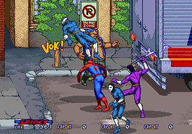
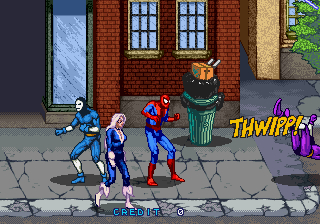

국내에선 별로 인기를 끌지 못했던 마블 코믹스의 시리즈중 하나인 스파이더맨을 바탕으로 제작된 게임인 스파이더맨은,  제목은 스파이더맨이지만 캡틴 아메리카의 일원으로 알려져있는 호크아이와, 블랙 캣, 서브 마린등도 함께 등장한다. 

하지만, 스테이지에는 베놈,그린 고블린처럼 스파이더맨에 등장하는 적들만 나왔고, 아마도 그래서 스파이더맨이라는 이름이 제목 아닌가 싶긴하다. 

게임을 시작하면 라이프가 400이 주어지는데, 라이프는 시간이 지날수록 조금씩 줄어들기 때문에, 게임을 빠르게 진행해야 하는 목표로 작용하기도 했다.

게임의 구성이 조금 특이한 것이 확대 축소 기능을 활용한 연출을 다수 보여주며, 벨트 스크롤에서, 플랫포머 형식의 전개도 보여주며 다이나믹한 전개를 보여줬던 게임이다.

거미줄을 사용할때의 THWIPP나, 스파크를 사용할때 SPARK와 같은 메시지는 만화에서 사용된 것과 같은 글씨체를 사용해서 미국식 코믹스 분위기를 잘 냈던 작품이기도 하다.