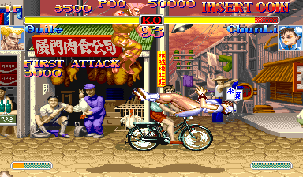
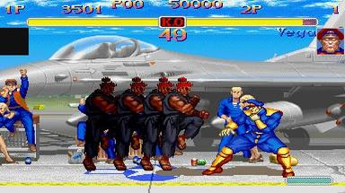

스트리트 파이터 시리즈의 최신작이었던 슈퍼 스트리트 파이터2 터보는 여러 가지 새로운 시스템을 선보였다.

슈퍼 콤보는 화면 하단의 게이지가 가득차게되면 사용할 수 있는 기술로 강력한 파워를 지녀서 게임을 반전시킬 수 있는 요소로 작용하게 된다.

이전 격투게임들에서 하단가드만하면 거의 모든기술을 방어할 수 있었는데, 슈퍼 스트리트 파이터2 터보에서 최초로 생기게 된 중단기는 하단가드를 하고있는 상대에게 타격을 입힐 수 있는 기술로써, 하단 가드 만능 구도를 타파했다. 

고우키가 시리즈 최초로 등장하게 됐는데 한번도 지지 않고 베가까지 가게되면 베가를 순옥살로 단번에 쓰러뜨리면서 등장했던 고우키의 임팩트는 다양한 루머를 양산하기 좋은 신비로운 캐릭터였다.

고우키가 정식 스토리로 의미를 가지게 되면서 세계관이 좀 더 풍성해지는 효과를 내기도 했다.