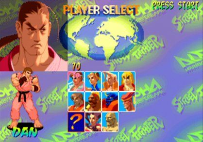
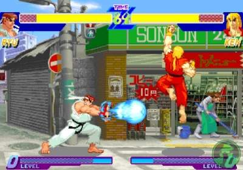

스트리트 파이터의 새로운 시리즈였던, 스트리트 파이터 제로는 스트리트 파이터1과 스트리트 파이터2 사이의 스토리를 그린 작품이다. (근데 왜 1.5가 아니고 제로지?)

당시 나는 게임을 아케이드 게임 위주로만 즐겼다보니, 이런 세계관 이동 (미래는 자주 봤으나 과거로의 회귀)을 다룬 작품을 거의 못봐서 매우 신기했다.

우선 켄의 머리가 상당히 길고, 내쉬(설정상 가일의 친구)가 등장하며, 파이날 파이트에 등장했던 가이와 소돔도 등장한다. 

고우키, 베가, 단이 숨겨진 캐릭터였는데, 고우키를 고르려다가 이상한 캐릭터가 골라지는 경우가 더 많았다. 그래서 난 포기하고 켄을 더 자주 썼다.

참고로 히비키 단은 SNK와의 갈등에서 등장한 개그 캐릭터다.

나중엔 훨씬 더 개그 스럽고 우스꽝 스러워지지만 그래도 제로에서는 나름 잘생겼었는데... 

[단 엔딩](https://bbs.ruliweb.com/family/508/board/182821/read/1814740)

슈퍼 콤보 게이지는 노멀모드일 때는 게이지를 3레벨까지 모을 수 있고, 오토 가드 모드일 때는 레버를 중앙에 두거나 공격하지 않을 때 자동으로 가드해주는 모드로 게이지가 1레벨까지만 모을 수 있다는 단점이 있었지만 초보자에게 유용한 모드였다. 물론 오토 가드 모드를 쓴다고 난이도가 확 낮아지는 것도 아닌 데다가 게이지가 덜 모여서 사람들이 안쓰다보니 얼마 안가 폐기됐지만 말이다.

제로 카운터(상대방의 기술을 방어하다가 반격하는 시스템), 제로콤보(약->중->강으로 이어지는 간단한 콤보 시스템)등 여러 가지 새로운 시스템이 도입되기도 했었는데, 이런 시도를 위해서 정식 네이밍을 쓰지 않고 제로 시리즈를 만든 건가 싶은 생각도 들었다.

특정 조건을 만족하면 류와 켄이 한꺼번에 베가와 붙는 드라마틱 배틀이 있었는데, 스토리와 연출을 중요시 여기는 관점에서 나온 모드라는 점에서 참신하게 다가왔지만 실용성은 별로 없었다.



그래도 친구와 함께 도전해볼 만한 숨겨진 요소였으며, 나름 인기를 끌었는지 콘솔 이식판에도 수록되고, 이후 시리즈에서도 이어지게 된다.