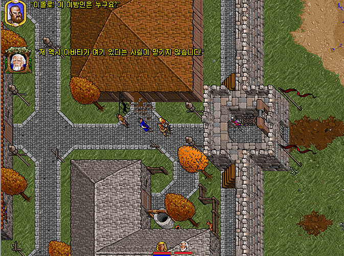
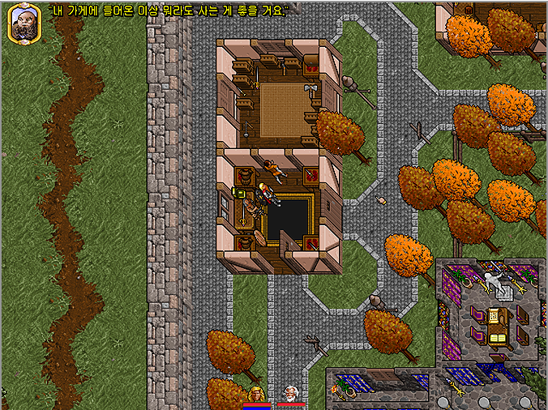

- 울티마 시리즈는 전통적으로 자유도와 창의성 사이에서의 균형을 잘 잡은 작품이었다.
    - 그 중 7은 정점에 있었던 작품이다.
        - 게임에 나오는 대부분의 사물로 플레이어가 상상하는 거의 모든 행동을 다 해 볼 수 있다. 양털에서 실을 뽑아 옷감을 만들어 옷을 짓기도 하고, 밀가루를 반죽하여 오븐에 구워 빵을 만들어 먹을 수 있다. 이러한 요소들은 훗날 쥐약을 넣은 빵으로 로드 브리티시를 살해하는 울티마 9편의 플롯으로 계승된다.
        - 중요 인물들도 볼 일이 끝나면 죽여도 아무 문제가 없고, 특정 시점을 넘어서면 아마게돈을 써서 대륙의 모든 사람들을 다 죽여도 스토리는 잘 진행된다.
            - 또한 특별히 봐야 하는 이벤트도 없기에, 아바타는 7편에서 로드 브리티쉬를 한 번도 알현하지 않고 엔딩까지 진행할 수 있고, 심지어 7편의 대표적인 악당 배틀린과는 이야기 한 번 안 섞고 몰래 검은 문을 파괴할 수도 있다.
- [[울티마1] RPG의 시작 울티마1 공략 #CRPG - YouTube](https://www.youtube.com/watch?v=yGCITMDeGf4)
    - 81년 작임에도, 자유도 높은 RPG를 훌륭하게 구현했음을 알 수 있다.