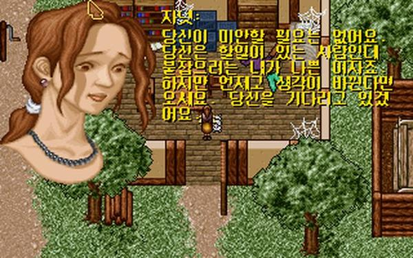
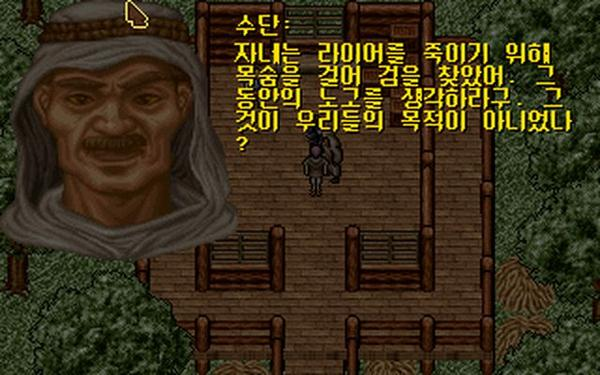
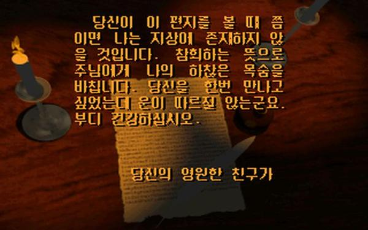

- 남인환씨가 만든 울티마 7에 큰 영향을 받은 RPG다.
- 일본식 RPG 게임이 스토리 진행을 할 때 옆길로 새지 못하게 철저하게 막는 걸 생각하면, 본작은 그런 게 없어서 언뜻 보면 게임의 자유도가 높은 것처럼 보이지만 문제는 디테일이 떨어진다는 점이다.
- 메인 스토리가 여러 갈래로 파생되는 게 아니라 하나로 딱 고정되어 있는 외길 진행이고. 후술할 멀티 엔딩 시스템이 단순히 게임 클리어 직전의 선택지에 따라 달라지기 때문에 엔딩에 이르는 과정이 바뀌는 것은 아니다.
- 제한된 범위 내에서 ‘무엇이든 해도 된다.’ 이게 아니라, ‘꼭 안 하고 그냥 지나가도 된다.’ 이런 개념의 자유도인 거다.
- 거기다 게임 내 등장하는 NPC 중 일반 시민들하고는 전혀 대화를 할 수 없고. 상점 주인과 메인 스토리, 서브 퀘스트와 관련된 인물들하고만 대화를 나눌 수 있어서 자유도가 더욱 낮게 느껴진다.
    - 일반 시민들의 존재가 그냥 낮이 되면 건물 밖으로 튀어 나와 마을 안을 어슬렁거리는 유동 NPC로 머릿수만 채우고 있을 뿐이다.
- 그럼에도 이 정도의 볼륨의 게임을 만들어낸 것은 꽤 훌륭한 시도였다는 생각이 드는 게임이다.