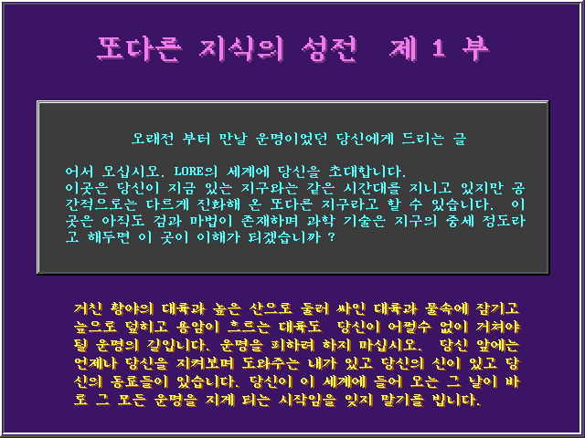

- 울티마 및 웨이스트랜드의 영향을 받아 제작했다고 한다. 아마추어 게임임에도 높은 완성도로 PC통신 시절 큰 인기를 끌었다. 이후 2부인 다크 메이지 실리안 카미너스와 3부인 비전 속으로가 공개되어 총 3부작으로 완결되었다.
    - 그래픽 자체는 당시로서도 떨어지고 전투도 텍스트로 표현되지만 국산 게임에서 찾아보기 힘든 자유도 높은 전개, 스토리만 진행할 경우 알 수 없는 숨겨진 요소, 깊이있는 스토리 등은 공개 게임임을 믿기 힘들 정도.
    - 울티마와 바즈 테일에 큰 영향을 받았고, 비슷한 형상을 띈다는 것은 부정하기 어렵지만 그럼에도 1993년 작임을 감안하면 매우 훌륭하고, 당시 공개 게임 중에 큰 인기를 끈 게임이다.