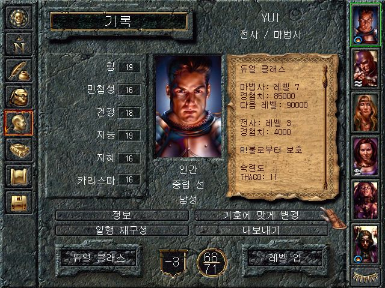
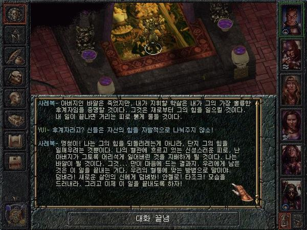
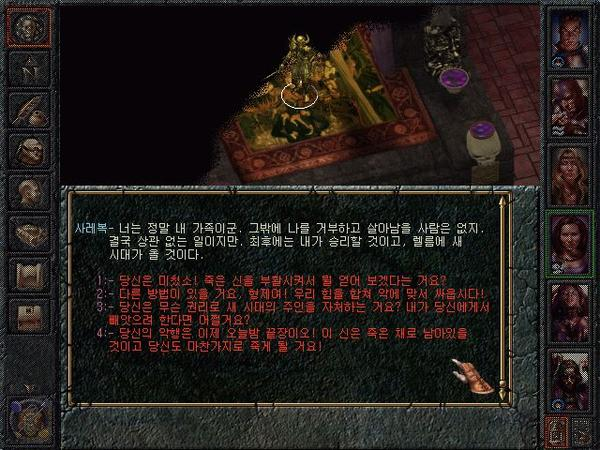
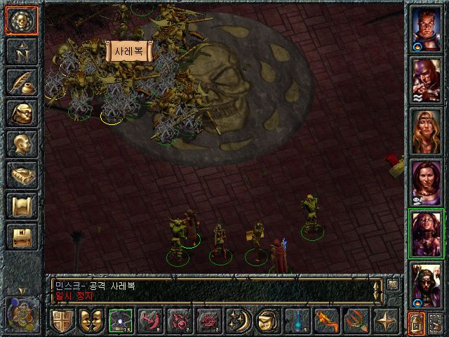

- D&D 규칙을 바탕으로 세계와 다양한 상호 작용의 선을 적당히 그은 작품이라고 볼 수 있다.
    - 예를 들어 NPC를 마음대로 죽일 수 있다거나 물건을 훔칠 수 있는 반면, 성향 (D&D에서 선, 악, 중립 혹은 더 세분화된 분류로 나뉘는 성향)에 따라 다른 상황이 펼쳐지는 것을 말한다.
    - 다양한 동료 캐릭터와의 상호 작용과 이벤트는 다양한 게임 플레이 양상이 나오는 결과물로 이어지긴해서, 자유도에선 부족할 지언정 게임 플레이 경험에선 만족감을 가질 수 있는 게임이었다.
        - 어찌보면, 온전한 오픈월드이자 자유도 높은 게임을 만들기 어렵다면, 선택할만한 적정선이 발더스게이트 수준 일지도?
- 일시 정지 한 상태에서 명령을 내리고, 다시 결과를 보고 멈추고 명령을 내리고 다시 진행하는 방식의 세미 턴제로 게임을 하는 경우가 많았다.

한국에서는 '자유도 높은 정통 RPG'라는 광고 구호로 홍보했는데, 실제로 창세기전 시리즈 같은 일본식 RPG가 주류를 이루던 국내 게임 시장에서 센세이셔널한 충격을 준 작품이었다. 

NPC를 마음대로 죽이기도 하고 물건을 훔칠 수도 있고, 스토리와 연출도 몰입감 있었기 때문에 '서양 RPG는 재미없다'는 당시 국내 게이머의 편견을 불식시켰고 다소 어설프지만 100% 한글화라는 요소로 많은 유저를 서구 RPG의 세계로 입문시켰다. 

또한 당시 D&D 룰은 한국에서 매우 낯선 것이었고 지금처럼 인터넷이 발달된 시대도 아니었기에 이 게임의 애니메이션은 일종의 장식이란 걸 모르는 사람들은 무슨 화살이 유도탄(...)이라거나, 분명히 파이어볼이 터지기 전에 실내로 들어왔는데 죽었다거나 하는 등의 성토가 PC 통신 게시판을 장식하며 나름의 문화충격(?)을 주기도 했다. 

하지만 울티마 등 기존의 서양 RPG에 익숙하던 게이머가 보기에는 오히려 자유도가 줄어든 측면이 커서 일본식 RPG라고 비판받은 작품이기도 하다.