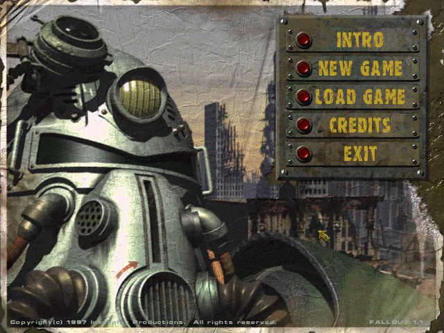
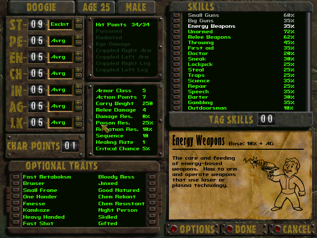
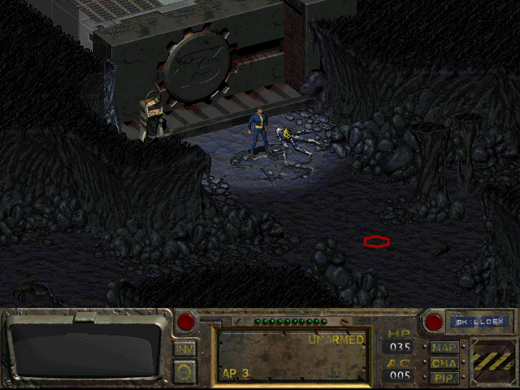
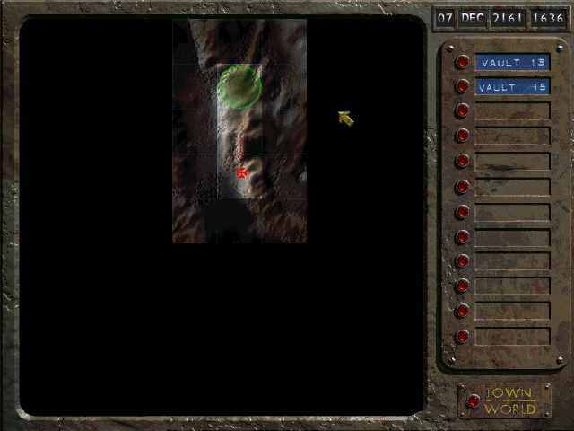

- 웨이스트랜드 리메이크 버전이지만, 그 자체로도 이미 올드하면서도 클래식으로 여겨지는 고전 게임이다.
- 포스트 아포칼립스 기반이며, 전투 시스템이 전략적이며 재밌는 것이 특징이지만, 지금 전반적 게임을 소개하는 맥락에서는 자유도이니 만큼 그에 대해 설명하겠다.
    
### 해결책은 하나가 아니다.

- 대부분 RPG에서의 퀘스트는 단일 해결책을 지향한다.
    - 그렇기에 대부분 노가다성, 몇마리 처치해라, 몇개의 재료를 모아와라 같은 방법을 채택하고, 정해진 결과를 달성하는 데에 치중되어 있다.
- 폴아웃은 이와 달리, 다양한 선택지와 그에 따른 결과가 펼쳐진다.
    - 애초에 미션자체도 단순히 뭘 해와 같은 일이 아니다.
- 예를 들어, 플레이어가 살던 볼트(vault)에 물을 정화하는 기능을 복구하려면 다른 마을에 있는 중요한 장치를 가져와야 합니다. 그러면 그 마을을 더이상 물을 정화할 수 없게 되고 모두 죽게 될 겁니다. 플레이어가 그 마을을 구해보려고 시도할 수 있지만, 그건 또 다른 문제를 불러올 수 있습니다.
- 어떤 마을에서는 두 사람이 마을의 지배권을 두고 싸웁니다. 둘 중 누구도 좋은 인간이라고 하기 어렵습니다. 결국 어느 놈이 마을을 지배하게 두느냐는 선택의 문제입니다.

### **문제에는 항상 다양한 해법이 있다 (그게 더 재밌다)**

- 앞서 든 선택의 예시들을 플레이어가 모두 무시하고 지나칠 수도 있습니다. 문제를 모두 해결하고 다닐 필요도 없고, 문제에는 언제나 다양한 해법이 있습니다. 플레이어가 보이는 건 모두 죽이고 다니고 싶다면 그렇게 할 수도 있게 할 겁니다. 문제 일으키기 싫어서 조용히 다니고 싶다면 그렇게도 할 수 있습니다. 흥정이나 거짓을 통해 말로 해결하고 싶다면 그렇게 할 수도 있습니다.
- 어느 하나의 플레이 스타일도 완벽하지 않습니다. 플레이어는 게임을 진행하며 여러가지를 시도하게 될 겁니다. 무장 캠프에 침투해야 할 경우를 예로 들어보죠. 잠입 기술을 이용해 잠입을 시도할 수도 있고, 말빨을 이용해 통과할 수도 있고, 아니면 전투 기술을 활용해 경비를 쏴죽일 수도 있습니다.

### **플레이어의 행동이 세계에 영향을 미친다 (그리고 세계는 플레이어에게 반응한다)**

- 게임은 플레이어가 어떻게 행동했는지에 따라 반응합니다. 플레이어가 술집에서 사람을 쐈을 경우 다른 손님도 그걸 인지합니다. 플레이어가 강해보이면 못 본 척 하고 자리를 뜨고, 플레이어가 만만해보인다면 시비를 걸어옵니다. 플레이어가 명성을 얻게 되면 NPC들도 그걸 인지하고 길을 비켜주거나 보자마자 총을 쏘는 등 반응을 보입니다. 우리가 하고 싶은 건 플레이어가 게임 속에서 일어나는 일에 ‘관여’하는 것입니다.