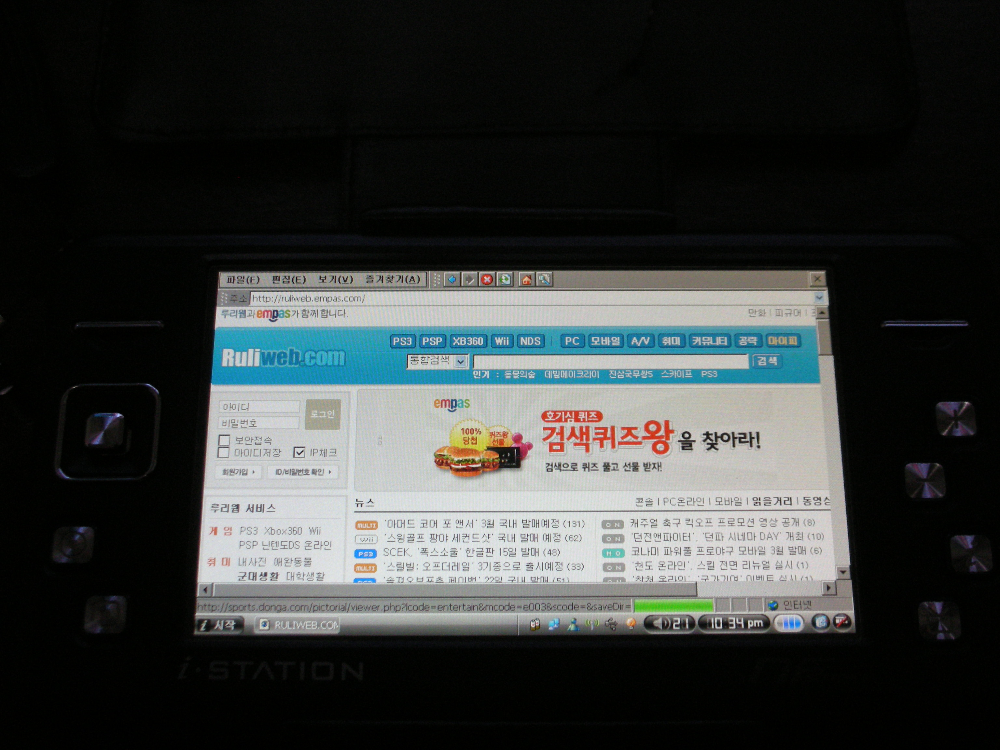
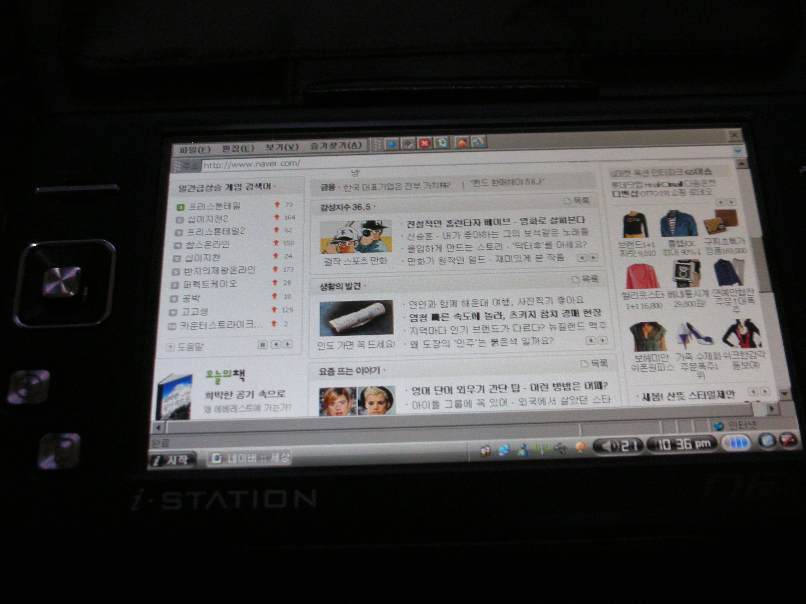
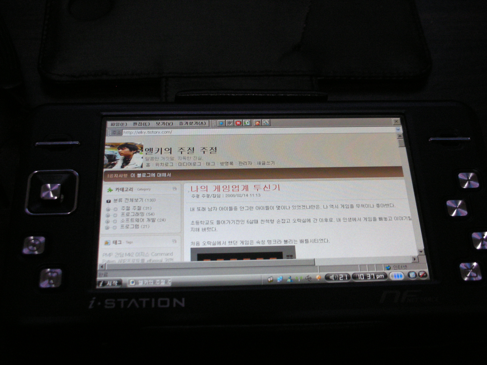
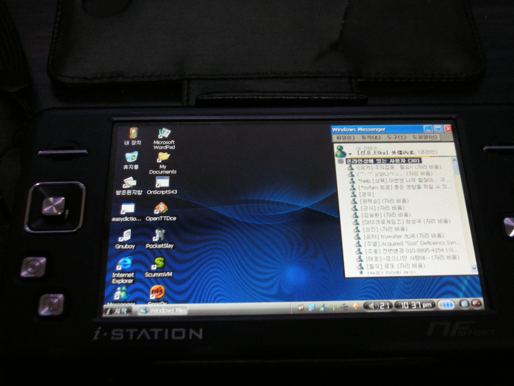

나는 가전 제품 사는걸 좋아해서, PSP며, PS2, PS3, XBOX, XBOX360, 게임큐브, MP3, NDSL, HDTV, 데스크탑, 노트북, 디카 등 다양한 가전 제품을 구입했다.

게임을 좋아라 하기도 하고, 신기한걸 워낙 좋아해서~ 자주 그분 강림으로 후회하곤하는데, 후회하게 된 제품은 되파는지라 NDSL, HDTV 등 몇 제품 내 손에 안남아있다.

그렇다보니 제품 구입에 조금 더 신중하게 하게 됐고, 한 제품을 놓고 일주일 이상 고민하고 난 이후에만 구입해, 그 분 강림을 막고 있다.

사실 작년 까지는 메모장을 애용했고, 올해들어 다이어리를 사용하고 있었는데, 다이어리 만으로 부족한 감이 없지 않았다.

PDA를 고르던 차에, 블루핀 OP67N이 할인판매 하는 것을 보게 됐고, OP67N은 200만 화소 카메라, 네비게이션 기능, 지상파 DMB, 윈도우 CE 5.0 plus 등이 탑재 되어 PDA적인 기능을 갖고 있는 제품이었다.

대부분 맘에 들었는데 조금 아쉬웠던 것이 무선 랜 기능을 USB호스트 기능을 통해 사용해야 한다는 점이었다.

그래서 구입하게 된 것이 넷포스 DMB다.

무선랜 내장에 지상파 DMB, 윈도우 CE 5.0 Net 버전이 탑재되어 내가 딱 원하는 성능을 갖추고 있었다.

가격도 PDA보다 저렴했고, 용량도 30기가! 넉넉하고 PMP이기에 인코딩 없이도 동영상 재생이 가능하니 너무 좋았다.

아이스테이션 계열이다보니 기본 내장 프로그램들도 우수했고, I-Planner와 코믹 그루가 특히 맘에 들었다.

일정 관리를 데스크탑으로 하는 데에 한계가 있었고, 다이어리의 불편한 점도 없는 내 첫 PMP이자 PDA 해상도도 800×480으로 우수해 웹서핑도 수월한 넷포스를 잘 활용해봐야겠다
