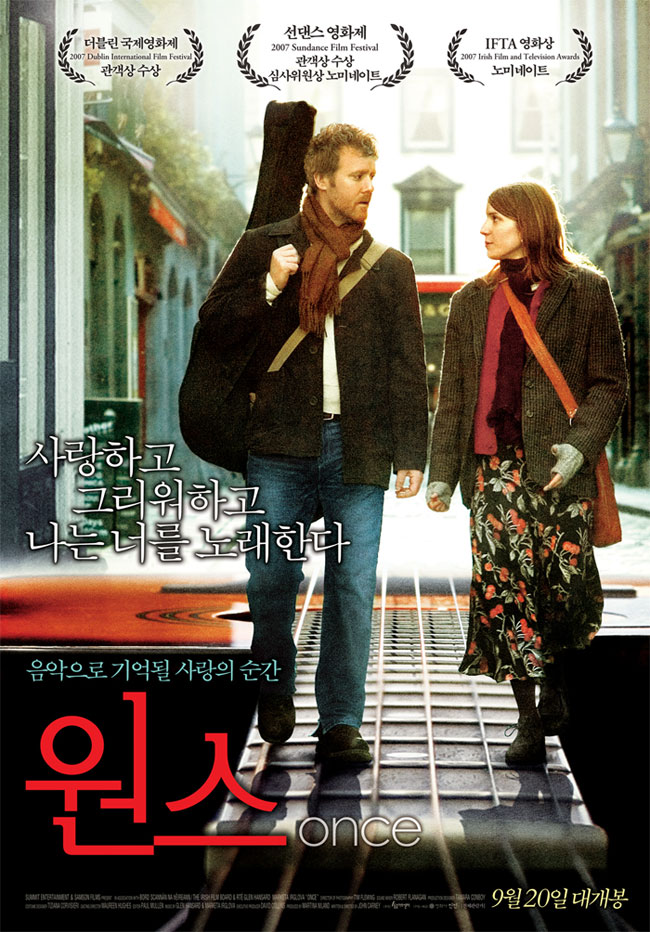

친구가 재밌을거 같다고 해서 궁금해하긴했는데, 큰 기대는 안하고 본 영화였다.저예산 영화였기에 대대적인 홍보가 있지도 않았고, 이 영화를 봤던 때에는 인디 영화 붐을 일으키며 인기를 끈다는 기사가 나오기도 전이었으니 말이다.

길거리 음악가이면서 청소기 수리공인 남자와 꽃파는 피아니스트인 한 여자의 이야기…

영화는 두 남녀의 만남을 아릅답게 그리지도, 애절하게 그리지도 않았다.

음악을 통해 친해지고, 음악을 통해 사랑하게 됐지만, 결국엔 이별을 결정한 두 남녀를 보면서 안타까운 맘이 들었다.

피아노 가게에서 함께 부른 Falling Slowly나, CDP 배터리를 사서 집으로 오던중 부른 If you Want me 같은 노래는 한동안 내 귀를 멤돌정도로 여운이 길었다.

두 남녀의 화음이 너무나 잘 맞아 놀라웠는데, 역시나 이 영화를 촬영한 이후 두 남녀가 사랑에 빠졌다고 한다.

모자란 촬영 기술이지만 그마저도 용서할 수 있었던 좋은 영화였다.