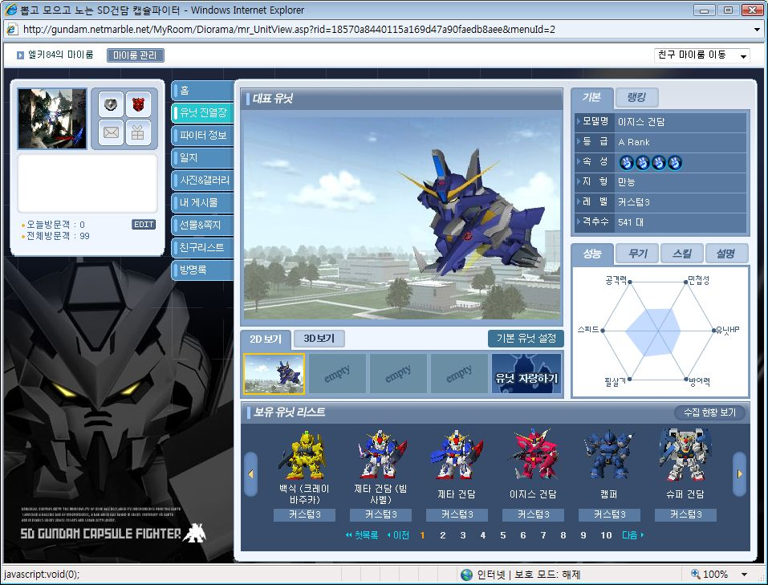

반사신경이 좀 느린지라, 액션 게임이나, 대전 게임을 좋아만했지 잘 못하는 나로썬...SD건담 캡슐 파이터 (이하 캡파)도 썩 탐탁치는 않았다.

워낙 기존 유저들이 세컨드 아이디로 초보채널에서 플레이 하길 좋아하고, 각종 콤보의 발달로 한번의 실수로도 산화되기 쉬운 게임인지라 처음엔 그다지 재미를 못느꼈다.

컨트롤이 다른 속성보다 중요한 묵기체로 게임을 시작해서 그렇게 된것도 있는거 같고.

어찌됐건 순탄치 않았던 나의 게임 플레이에 빛을 보게 해준건 바로 산탄과 바주카!!

오토 락온을 나는 중사때까지 몰랐었다 -_-;;

그렇다보니 기왕 맞추기 힘든거 한방 맞췄을 때 큰 데미지를 주는 바주카 계열로 플레이 하다보니, 락온을 알게된 이후에도 바주카 계열을 좋아하게 됐다.

6개월간 열심히 해온 나의 전적이다.

3000게임 가까이해오면서, 승률 50%대를 유지해온 것은 감격이 아닐수 없다!

밑에는 내가 사용하는 유닛들중 몇가지만 간추려 봤다. 재미로 봐주시길~!

묵기를 잘 못 다루지만 그나마 내 손에 가장 잘 맞았던 기체는 바로 묵젯! 제타 건담이 건담 중 손에 꼽히게 멋지다고 생각하기도 하고, 워낙 범용성이 좋은 기체라서 애용해왔다.

칼질이 워낙 빠르고 리치도 적당한 편이라 너무 맘에 드는 기체다.

이 기체가 바로 내 주기체 백식이다. 2300킬을 자랑하는 내 백식은 다른 기체를 몰다가 승률이 떨어지거나, 짜증이 밀려올때 고르곤 한다. 한방 데미지가 크기도하고, 산탄의 힘으로 맵에 따라 다르긴하지만 빠기는 물론이고, 돌격형 묵기를 상대하기 쉽다는게 맘에 든다.

개방형 맵과 우주전에서 약한 점이 조금 걸리긴하지만, 그럼에도 백식은 충분히 매력적이다.

빠젯의 경우 묵젯을 만들기 위해 포함되어서 만들게 된 기체여서 그 과정일뿐 딱히 큰 기대를 하진 않았다.

저격 기체는 아니지만 리로드업과 공업 스킬 발동 되면 데미지도 좋고, 가변을 하지않아도 무한에 가까운 빔을 쏠 수 있단 장점도 있고. 게다가 칼 리치가 길어서 소드마스터의 자질을 갖고 있는 개념기다.

특히나 잘생긴 제타이기 때문에 뭐든지 용서될텐데 딱히 단점도 없으니~ 대만족~!

사실 빠쿠는 생긴게 못생겨서 싫었는데...3번 미사일이 스플끼도 있고, 다운 효과도 있는데다가 리로드업을 뜨면 1:1 시에 상대방을 무한 다운 시킬수 있다는 장점이 있다.

백신을 기본 장착하고 있다는 점도 장점이고.

사실 슈퍼 건담은 더블 제타 건담 만들기 위해 뽑았다. 허나.. 더블 제타가 칼이 큰대신 칼질이 느려 맘에 안들더라.

슈퍼 건담은 저격 기체 임에도 정밀 저격이 없다. 하지만 3번 미사일을 장거리 빔으로 생각하고 사용했더니, 한방 한방 데미지가 워낙 커 화끈한 매력이 있었다.

화끈함에선 비슷하지만, 백식과는 달리 부스터가 부족한 편에 속해 기동전을 펼칠수 없단 것이 단점이라면 단점. (이봐! 빠기라구!)

이지스의 경우 나의 첫 A랭이다. 그때는 오토락온을 몰라서 매우 힘들게 게임했지만, 오토락온을 알고나니 이지스의 진짜 위력을 알 수 있었다.

다운빔, 경직빔, 기본(?) 빔 등 3종류의 빔이 존재하기에 상황에 따라 선택의 여지가 매우 많다.

비록 경직 효과가 크게 하향되어 아쉬운 점이 있긴 하지만 여전히 좋은 기체다.

마지막으로 소개할 기체는 바로 캘러미티다. 일명 좀러미티라고도 불리는 이 기체는 페이즈 시프트 장갑이라 불리는 실탄 보호 장갑과, 철벽 방어가 한꺼번에 달려있어 탱커의 역할을 제대로 해준다. 2번이 빔이고 3번이 바주카라 다운 무기가 없는 것을 제외하곤 적절한 무기 배분에, 근접 공격이 4타라서 타이밍 맞춰 잘 사용할 경우 상대방을 좌절 시키는 효과도 줄 수 있다.

이 기체를 시작할 당시 지금보다 더 돌격형 플레이를 좋아했는데, 돌격을 하고도 덜 죽는 다는 것이 이 유닛의 장점이라고 할 수 있다.

이렇게 몇개월씩 열심히한 게임은 손에 꼽는데, 건담의 매력이란 정말 대단한 것 같다. 이 게임을 시작하고나서 애니메이션이나 프라모델도 손을 대게 됐으니 말이다.

물론 클라이언트의 안정성에 문제가 있다는 점이 아쉽긴한데...뭐 그거야 -_-; 개발자 입장에서 이해하고 넘어간다 했을 때 초반 게임 접근성이 떨어지는 문제만 해결한다면 더 인기 많을 게임이 되지 않을까 생각한다.
