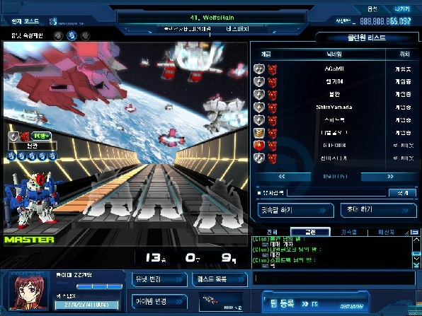
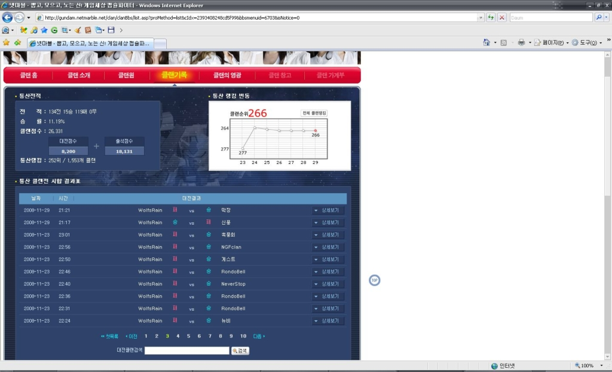
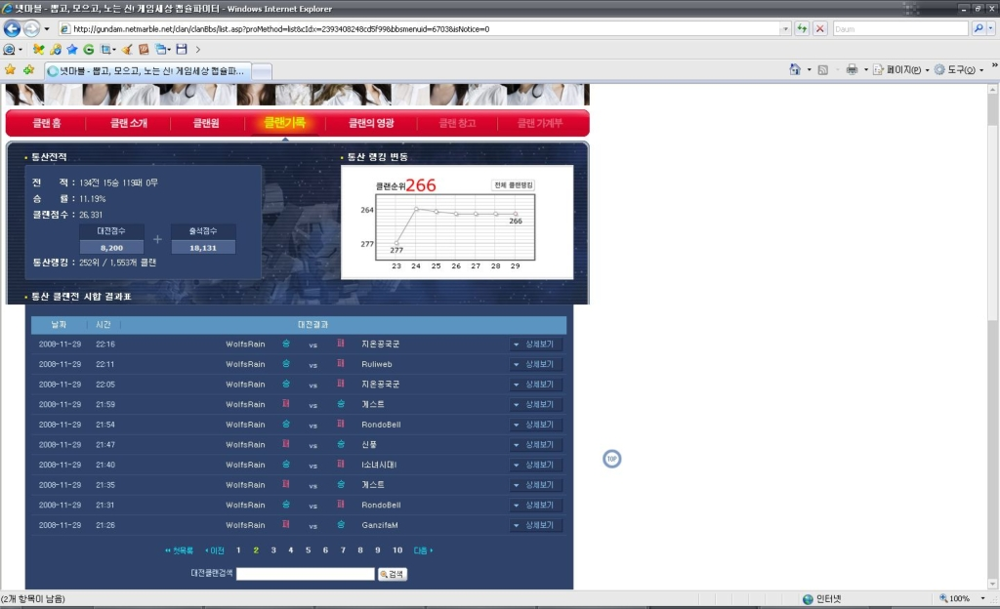
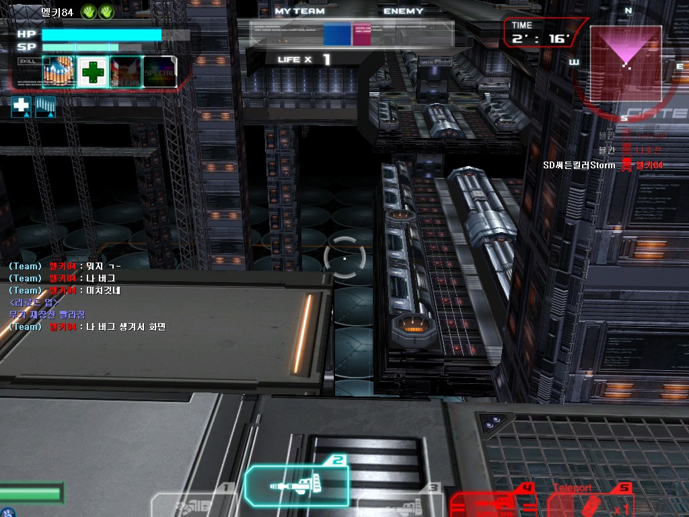
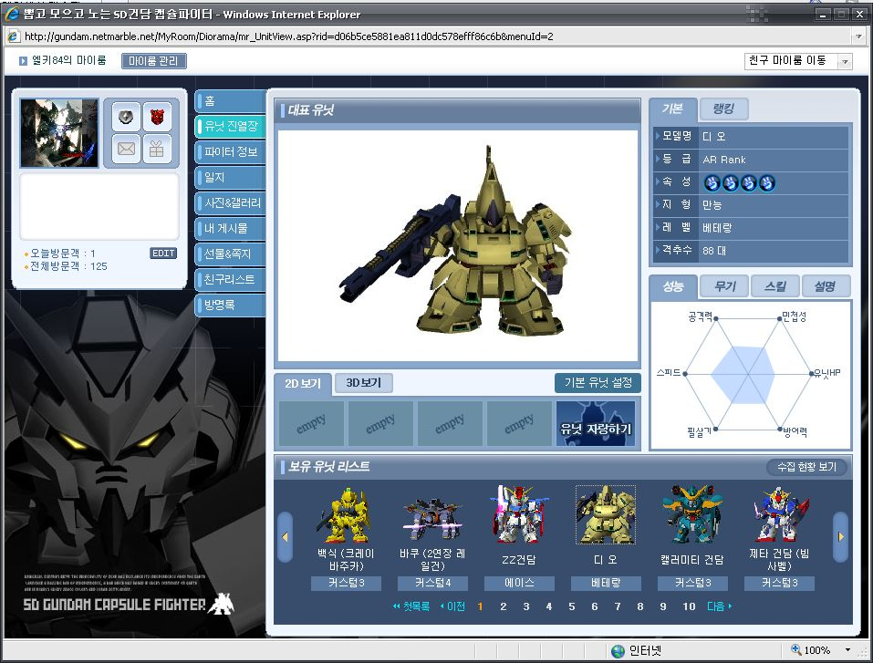

나의 캡파 클랜은 Wolf's Rain 이다.

함장을 포함해서 주요 멤버가 친구들인 친목클랜이긴한데...

클랜전을 종종 뛰곤 했다.

그렇게 쌓아온 엇그제까지의 클랜전 전적은 3승 109패....-_-;

한마디로 싸웠다하면 졌다는거다.

뭐 그래도 끈기를 갖고, 또 다시 도전한 클랜전!

그런데 첫 게임을 이겼다! 3승 109패의 팀이 첫판을 이기다니...

기쁜 마음으로 계속 게임을 하다보니 2판중 한판정돈 이겼고, 그 결과 12승 10패의 호 성적을 거두며, 현재까지의 승리의 4배를 거두는 쾌거를 이뤘다.

클랜 창설이래 최고의 날~!! 11월 29일을 기억하리라!!

13승 9패로 나와있는 이유는, 타임아웃시 전적 체크가 잘못되는 소맥의 버그 때문이다. (DB에 기록된 정보가 잘못된 것일 가능성도 있고)

여기서 잠깐!! 시점이 1인칭으로 바뀌고 조작이 되지 않는 버그로 인해, 남은 몫 2몫을 날려버린 버그...-_- 소프트맥스여! 책임져달라! 날려버린 1승!!

분명히 우리가 이기고 있었는데...두 몫중 한몫만 건졌어도 승리가 가능한 상태였는데... 너무나도 억울했다.

캡파가 12월 23일 대 개편을 앞두고 있던데, 로딩중에 뻗는 버그와, 이런 버그들을 해결하지 못한다면...새로 유입되는 유저 만큼 떠나는 유저가 늘수도 있단 생각을 해줬음 좋겠다.

클랜전이나 요 근래 게임을 하면서 느꼈던건...나에게 묵기는 맞지 않는다는 것과...나는 빔보다 바주카나 레일건 계열이 훨씬 승률이 높다는 것이었다. -_-ㅋ

지난주 나의 첫 AR기체 찌디오를 뽑게되어 기쁜 마음으로 몰게 되었지만...백식, 캘러미티, 빠바쿠만한 승률을 유지해주지 못했다.

물론 아직 솔져부터 대전을 한지라, 스킬도 안뜨고 커스텀도 안찍은 상태이긴했지만 승률이 큰 차이가 난건 사실이다.

클랜전 얘기로 다시 넘어가자면... 심각한 저 승률의 요인중에 하나로는 내가 묵기를 잘 못하는데도, 속성 분배상 묵기(주로 묵돔, 캠퍼, 릭디어즈 레드)를 했던게 클랜전 패배의 원인이기도 했던듯 싶다. 

A랭이 아닌 B랭, C랭이건간에 4:4이기에 한명 한명이 각자의 몫을 해주어야 하는데 오히려 짐이 됐던 것 같다.

어쨌거나, 다시한번 어제의 승리를 자축하며 앞으로도 어제처럼 승리가 더 많은 날이 자주 왔으면 하는 바램이다.
