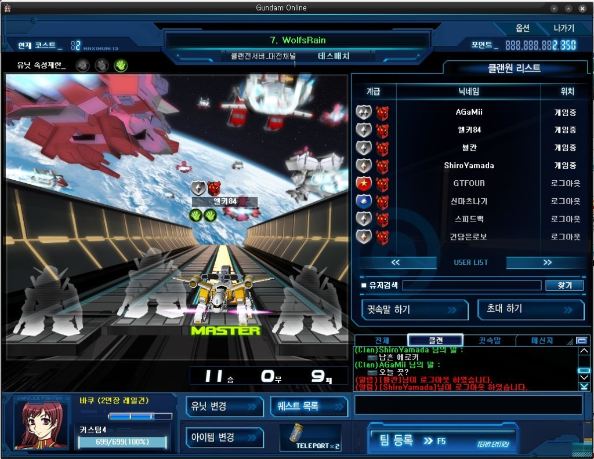
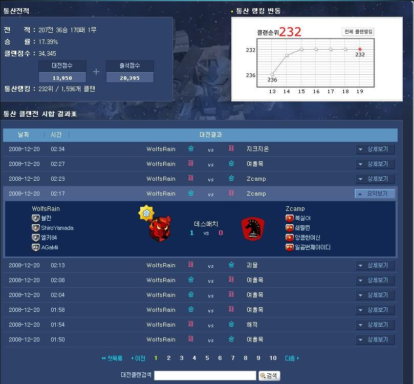

지난번 12승 10패의 벅찬 승리 이후 3주간 패배의 구렁텅이에 빠져있었다.

4승 6패, 2승 11패, 1승 8패.... 조합도 문제였고....팀의 특성도 없고, 조합의 장점도 못살리는 애매한 플레이로 패배를 거듭했다.

12월 19일 치뤄진 클랜전은 본인의 송년회로 인한 음주와, 피로 누적 상태의 최악의 컨디션이었으나, 예상 외로 초반 6경기를 5승 1패를 거두는 쾌거를 이루며 신나게 시작했다.

비록 이후에 패배와 승리를 반복하며 11승 9패를 거두었고... 우리가 승리를 거둔 클랜중에는 Zcamp, 지크지온, 게스트, 괴물과 같은 명문 클랜도 있었다.

특히 Zcamp의 경우는 모두가 준장 이상의 고 계급이었기에 더더욱 큰 쾌거였다.

이 날 클랜전 멤버 모두 친구들이었는데, 어찌된게 같은 PC방에 모여서 게임할때보다, 내가 자취방에서 플레이 하는 날이 더 승률이 좋은것일까? -_-;

더 웃긴건... 요새 내 공개방 승률이 엉망이었다. 했다하면 지는 정도로 엉망이었는데...클랜전이 훨씬 승률이 좋았다면...이건 뭐? -_-;

아무래도...나는 빠쿠가 적성에 맞나보다 -_-;

내 플레이에 기복이 있는 점 때문에, 내 역할이 C랭에 적합한걸지도 모르겠다.

어제의 클랜전은 중후반 집중력이 흐트러진 경기도 있긴했지만....전반적으로 적당한 긴장감으로 아주 즐겁게 게임했다. 언젠가 킹오브 클랜 우승 마크를 달 수 있는 날을 위하여~!! 아자~!
