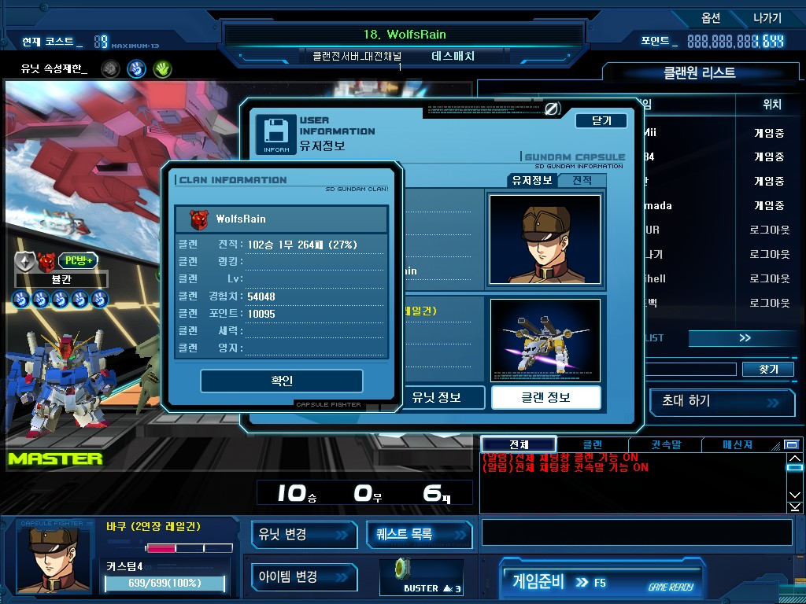
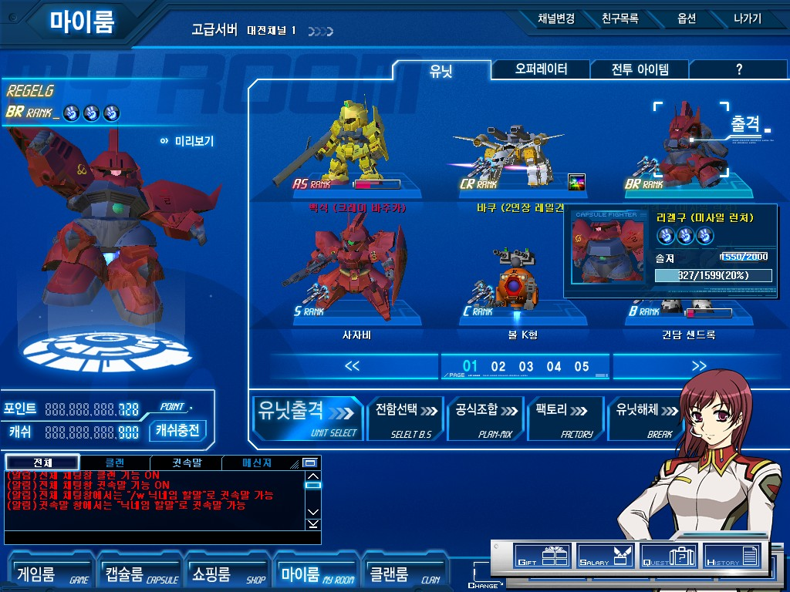
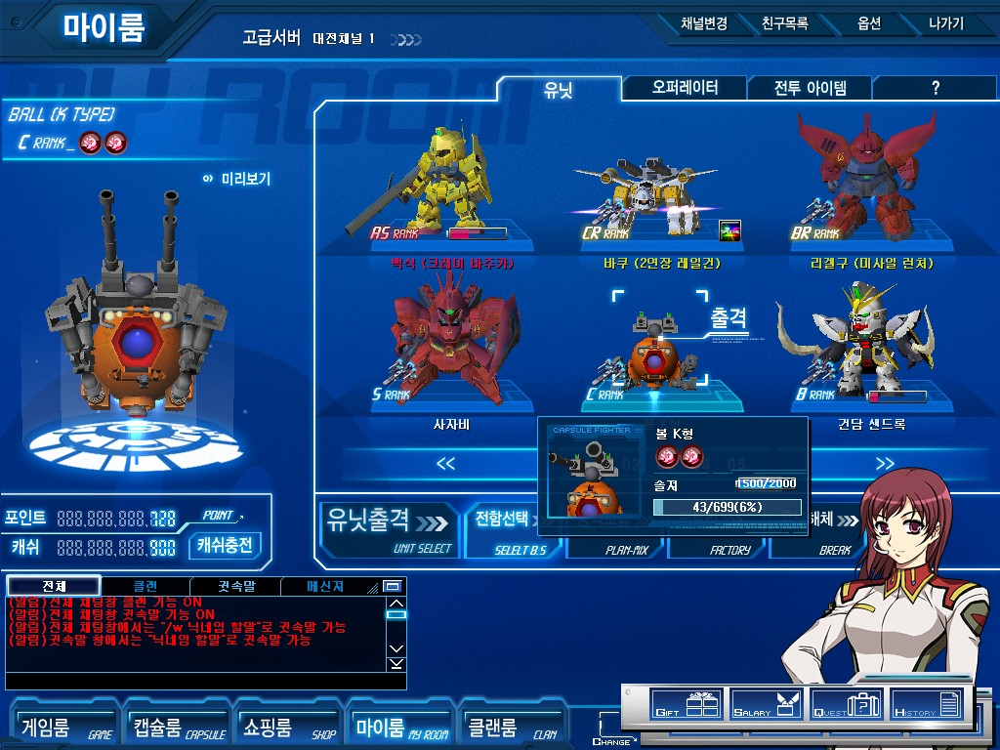
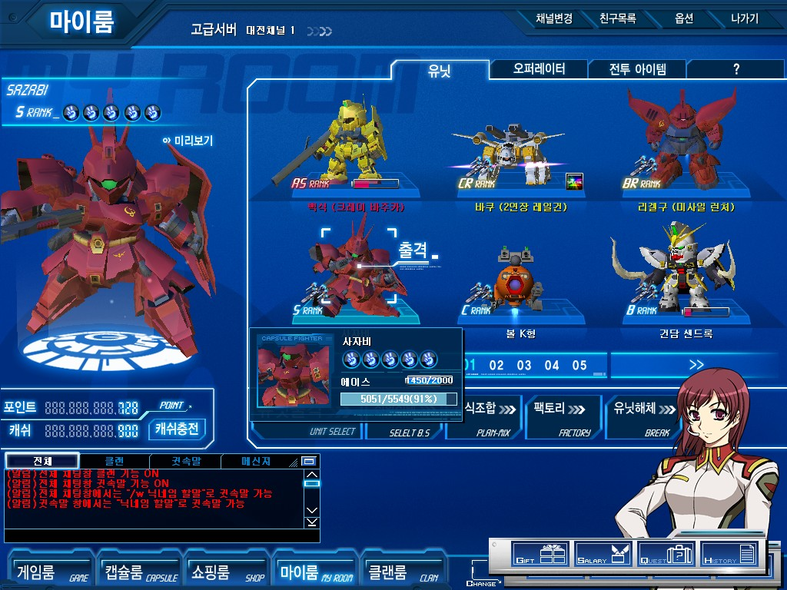
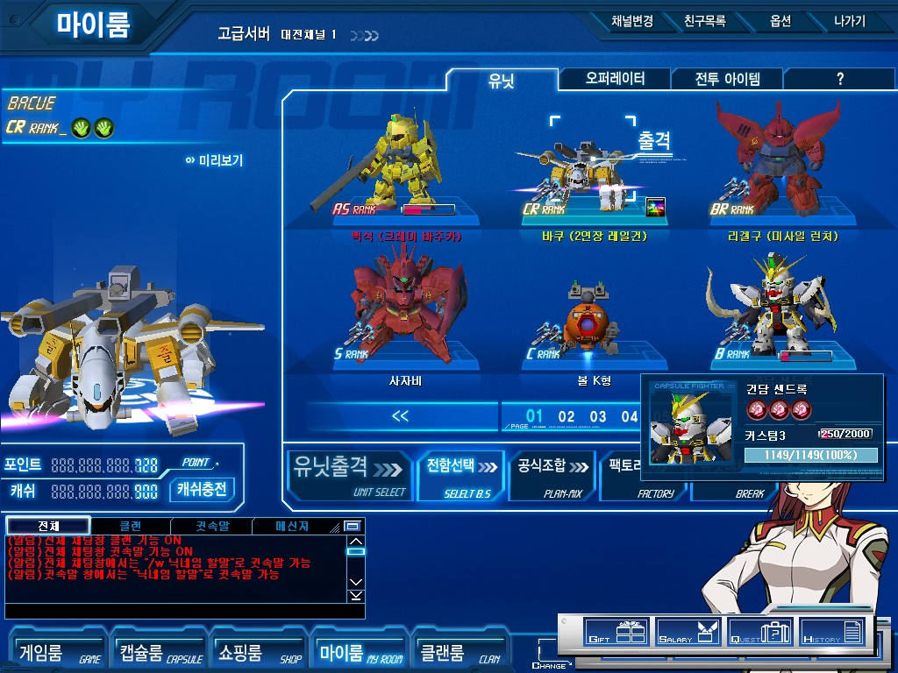

SD건담 캡슐 파이터를 즐긴지가 어느덧 1년이 되었다.

사실 클랜 창설의 취지가 친목 도모적인 의미가 강했지만, 2008년 4월 패배의 나날을 걸으며 3승 100패로 시작했던 클랜전이 어느 덧 100승 고지를 달성했다!!

초반부 시행 착오였던 3승 100패를 빼면, 이후 전적은 99승 1무 164패.

여전히 높은 승률은 아니지만 비약적인 발전을 해냈다고 볼 수 있다.

험난해보였던 100승 고지를 어찌됐거나 달성하게 됐고! 그 과정에서 막장, 괴물, 게스트 등의 강한 클랜들을 꺾은 전적도 포함되어있기에 더더욱 보람찼다.

결과적으로 이 날 최종적으로 10승 6패의 호성적을 거두었고, 킹오브 클랜에 도전하는 클랜으로써 그 다짐을 더욱 확고히 했다.

이 날 6패의 대부분은 막장이나 게스트 등 강한 클랜들과 싸우다 생긴 패배였기에 (한끝차이로 진 패배가 많았기에 더더욱) 킹 오브 클랜 도전이 허황된 목표가 아님을 체감할 수 있었다고 생각한다.

업데이트가 된지 한참 지난 이제서야 뽑게된 BR 리겔구 (일명 미겔구. 미X겔구그) 3커다. 2커는 뽑았던 적이 있지만, 나는 풀커 (나올수 있는 최대한의 커스텀 포인트) 유닛만 모으는지라... 2커 짜리를 해체하고 얻은 3커 미겔구다. 뽑자마자 1페이지에 등극했다.

우리 클랜과 붙어보신 분들은 이미 아시겠지만 내 클랜전 주기체는 온리 CR 바쿠(일명 빠 바쿠, 빠쿠)다. 초반 클랜전 이후 사실상의 클랜전은 바쿠로만 치뤄왔지만, 새로운 조합도 필요하기에 미겔구도 클랜전에 적극 사용할 예정이다.

미겔구보다도 힘들게 뽑은게 난 볼 K형 (일명 묵볼) 이다. 사실 나는 묵기 컨트롤을 잘 못하고 내 주기체는 대부분 미사일류 기체이지만 묵볼의 경우에는 바주카가 워낙 강하기도 하고, 3번 무기 프리허그의 강력함으로 한번쯤 써보고 싶었다.

미겔구와 마찬가지로 클랜전 유닛으로 사용할 용도로 뽑은 유닛이고, 실제로도 적극 사용 예정. 

소프트맥스의 상술에 속아(?) 구입한 3커 사자비 한정판매판이다. 사자마자 에이스라 키우는 노가다를 좀 덜할 수 있다는 점에서 가산점을 줬다.

판넬, 감도 좋은 빔짤, 사거리는 짧지만 리로드도 빠르고 탄속도 빠른 미사일 등 다양한 장점을 가진 유닛이다.

철벽 수비도 있어 빠기에겐 재앙이지만.... 나는 클랜전에서 BC랭만 사용하니...패스!

위에서도 설명했듯이 나의 클랜전 주기체인 빠쿠다.

양쪽 어깨에 즐을 붙인 것이 특징이다. 필살기에 맞게 되면 즐이 보이는데, 정신적인 데미지를 받았다는 분들도 계셔서 계속 붙여놓고 있는 상태다.

페인팅도 흰색과 주황색을 섞어 배색했는데, 발랄한(?) 느낌이 들어 아주 맘에 든다.

랭크가 낮다는 장점을 앞세워 클랜전뿐만 아니라 데스 매치에서도 사용빈도가 늘어, 사실상 백식을 제치고 나의 주기체로 등극했다. 

근데... 나는 분명히 빠쿠에 광택제를 발랐는데... 티가 않난다 -_- 왜!!! 어째서!!!

여러 유저가 캡파의 클랜전이 태그 매치로 열려야 된다 말하고 있고, 그렇게 된다고 생각하는 유저들도 있는걸로 알고 있는데, 나는 그렇게 되지 않았으면 좋겠다.

태그 매치의 경우 코스트 제한을 넣기도 어려울 것이며, 전략성이 떨어진다고 생각한다. 난 임기 응변과 컨트롤만으로 승부가 갈리게 될 클랜전을 원하는 사람이 많다고 생각치 않는다.

현재 치뤄지고 있는 리그전은 이미 태그매치/일반대전/데스매치 방식으로 열리고 있다고 하더라도, 클랜전과 킹 오브 클랜은 지금 방식으로 유지됐으면 하는 바램이다.
