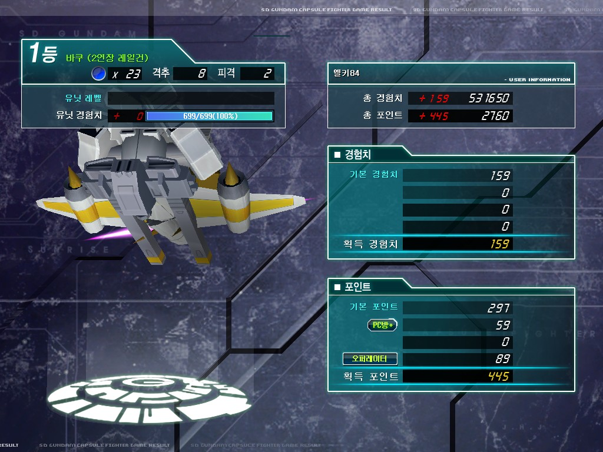
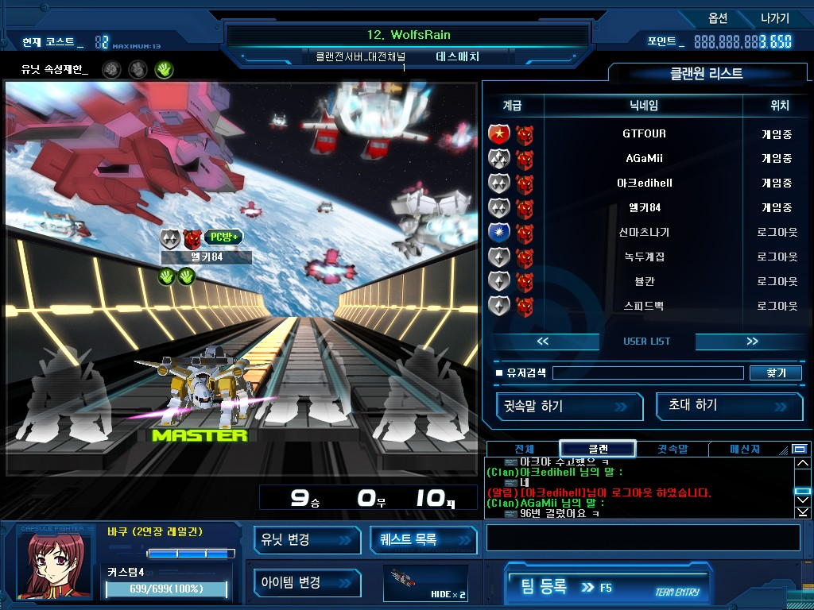
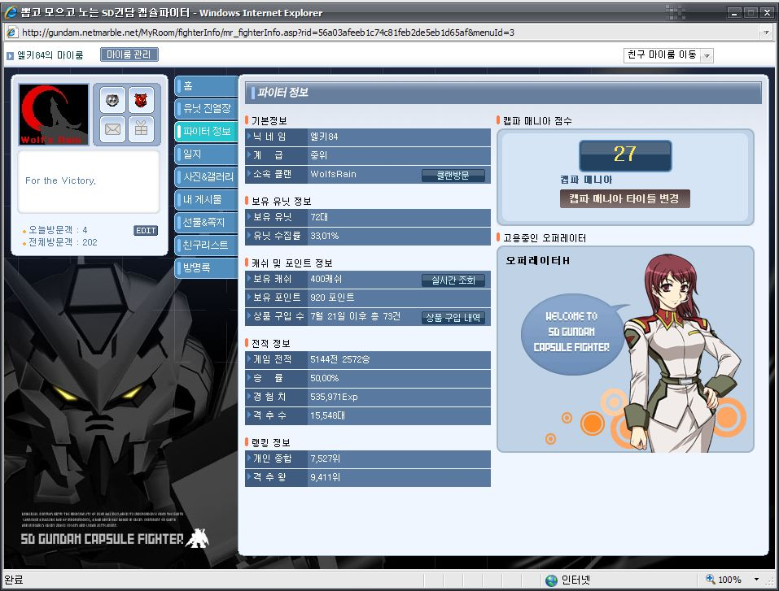
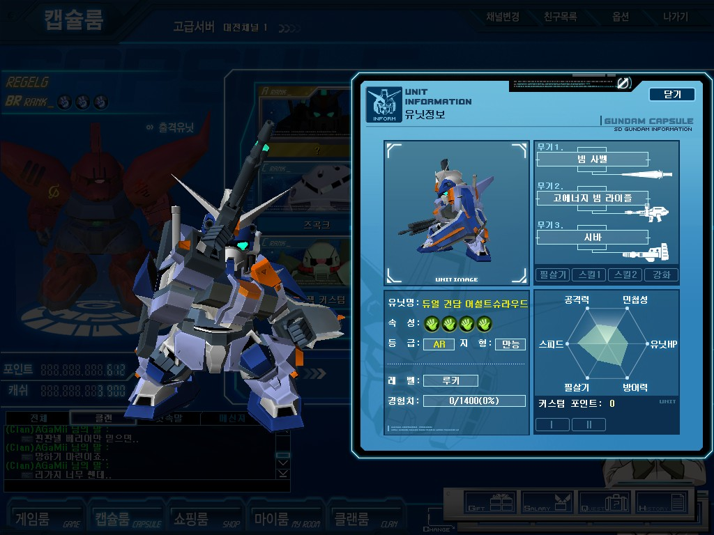
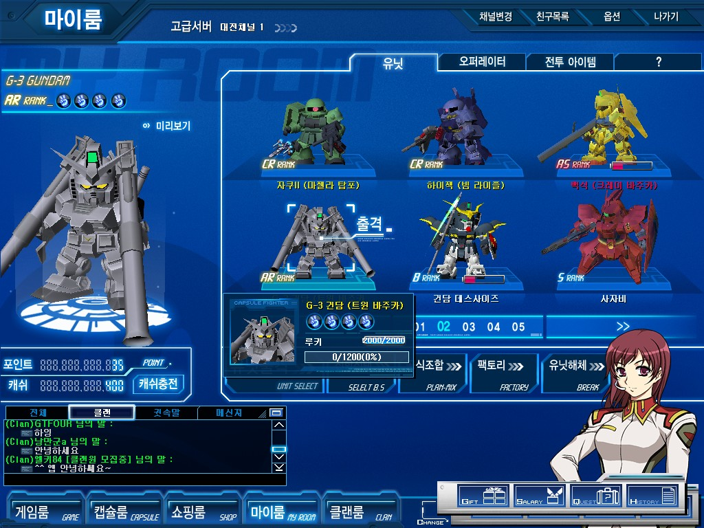
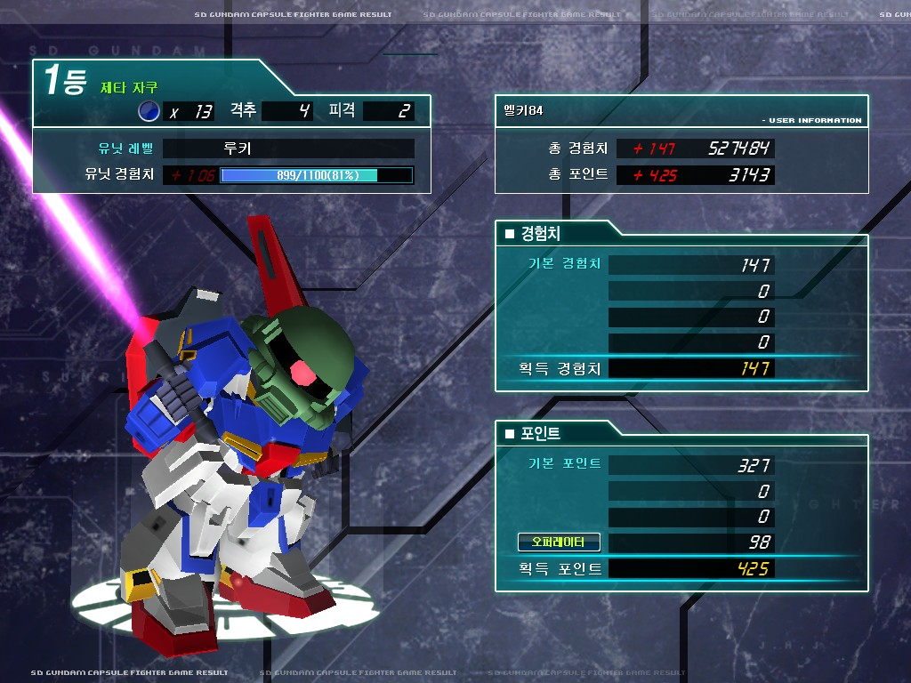

우리 클랜의 장점이자 단점은, 주요 멤버가 실제 친구들이라는 것인데, 캡파 때문만이 아니더라도 자주 모이는 사이이기에 클랜전을 같이 뛰는 경우가 많긴하지만, 이 멤버들이 늘 모일순 없는것이고, 이외에 클랜전을 뛰는 게이머가 부족하다는 것이다.

물론, 우리 클랜의 유일한 준장이신 GTFour님 께서 계시고 클랜전도 같이 뛰어주고 계시지만, 5명으로는 조합의 한계, 클랜 내전/클랜 내 클전 연습도 불가능하기 때문이다.

사실 수 많은 유닛을 다루더라도, 실제로 클랜전에서도 능숙하게 다룰수 있을 기체는 소수이고, 위기에서 능력을 발휘하려면 그만큼의 숙련이 필요하기에 다양한 유닛을 평균적으로 다루는 사람보다는, 스폐셜 리스트가 클랜전에선 필요하다. 특히 킹클에선.

하지만, 우리 클랜의 조합은 비교적 단순한 편이고, 다양성이란 면에서 단점을 갖고 있다. 물론, 알면서도 당하는 조합도 나쁘지 않겠지만, 별개의 조합이 하나쯤 필요하다고 본다.

그런 의미에서 20일 클랜전은 큰 의미를 가진다고 본다. 아크edihell군이 클랜전 멤버로 새로 합류했기 때문이다.

새로운 조합을 통해서 9승 10패를 거두었는데, 친구들과 맞추던 조합과 팀플이 아닌 경기에서 이정도 성적이면 준수했다고 생각한다.

클랜전에서의 8킬! 숨길수 없는 막타 본능이 여실히 발휘되었다.

아쉽게도 캡쳐를 하지 못했지만, 이날의 영웅은 Agamii 였다. 믿을 수 없는 용자플레이로 2대 1을 역전했기 때문이다. 

이 날 뿐만 아니라 Agamii는 클랜의 역사다. Agamii의 개인 클랜전 승수와 우리 클랜의 전체 승수가 같다. Agamii가 아이템과 스킬을 쓰지 않고 플레이 한다는게 조금 아쉬운점인데... 이 부분에 대한 보강만 이루어지면 조금 더 좋은 성적을 거둘 수 있으리라 믿는다. 

이 기세를 몰아 21일 클랜전도 성적이 꽤나 좋아 11승 6패를 거뒀다. 애석하게도 아쉽다는 부분이 이날 여실히 드러났는데, 우리 클랜의 패배가 주로 현재 킹클 우승 전력권의 클랜들과의 경기에서 나온다는 점이다. 중위권 클랜과의 클랜전에서의 승리로 성적이 좋아지고 있지만, 아직 많이 부족하다고 느꼈다.

아쉽지만 현실을 인정하고 나아지기 위해 노력해야 할 것이다.

추가로 중위 진급 겸 승률 50.00% 회복 기념 스샷이다. 이게 얼마만의 50%대 돌입인지.... 3000게임 즈음해서 올렸던 포스팅 이후 승률 49%대에서 계속 머물러 있다, 몇달만에 겨우 겨우 복구한 승률이다. 다신 50% 밑으로 내려가지 않으리라~!

이번에 몇일만에 연속으로 나온  AR 둘인 G3트바와, 어썰 슈라다.

어썰슈라는 마탑으로 스나이핑 연습중에 나와서 좋았고, G3트바는 바주카/레일건 계열을 선호하는 나로써는 나온 직후부터 지금까지 쭉 뽑고 싶어했던 기체였기에 너무나도 기뻤다.

사실 2주전에 묵윙도 나왔었는데, 묵윙은 내 스타일 기체가 아니라서...그다지 감흥이 없었다.

귀염둥이 앗가이의 뒤를 잇는 개그 유닛 제타 자쿠다. 설마 소맥이 이걸 내리라곤 상상도 못했는데... 이동할때 발 움직임이나 공격할때 모션이 너무 귀엽다 ㅎㅎ

2번, 3번 모두 리로드가 극악이라는 점이 리스크가 있긴한데, 3번 미사일이 컨트롤 쇼크 효과를 가지고 있어, 많은 유저들이 선호하고 있는 상태이긴하지만....나는 바주카를 사랑하기 때문에! 뽑아는 놨지만 키우는 것은 보류중이다.
