Wolfsrain 클랜이 창설된지도 어언 1년 반. 작년 연말 이후 잘나가던 클랜전을 뒤로하고, 슬럼프를 겪은지 몇달.

동네북처럼 패배의 나락에서 헤어나오지 못했다.

지난 달 킹클은 개인 사정으로 인해 참가하지 못했지만 클랜의 선전을 기원했것만... 돌아온 결과는 1회전 탈락이었다.

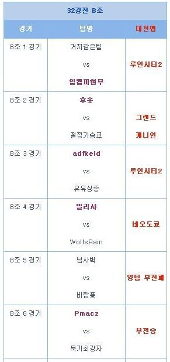

이 것이 지난 6월 킹클 결과다. 뭐 자세한 경기 내용은 못봤으니 모르지만...공명 리가지의 활약으로 인한 패배였다고 하더라.

어쨌거나 클랜전의 부진이 심화된 시기에 킹클에서 잘할리 없는건 당연한 일.

그래서 클랜전에서의 새 조합 연습도 시도하고, 클랜전 연습을 다짐했다.

허나 세상일이 그리 쉽던가? 서로간의 시간 맞추기도 쉽지 않았고, 클랜전에서의 새 조합은 패배의 나락에 빠질 뿐이었다.

특히 마스터 건담 혹은 갓건담을 필두로한, [격반 S랭, 블리츠, 지작, 빠쿠] 조합은 승리를 가져다 주지 못했다.

기존의 클랜전 승승 장구의 조합인 [풀아머 더블제타, 앞사, 묵볼, 빠쿠] 조합이 승률은 훨씬 좋았지만, 시대의 흐름을 따라가자는 의견에 따라 또다른 조합을 시도했다.

그래서 나온 조합이 [파라스 아테네, 공명, 공명, 데사] 조합.

이 조합의 단점은 순간 화력이 굉장히 약하단 점이었다.

이 점을 보완할 조합으로 생각한 것이 [파라스 아테네, 공명, 슈건, 데사] 조합이었다.

---

아쉽게도 우리 클랜의 문제는 단순히 조합에 있는것만이 아니었다.

실제 7월 킹오브 클랜은 [파라스 아테네, 앞사, 빠쿠, 데사]의 조합으로 나갔는데, 경기 내내 커뮤니케이션 미쓰와, 판단 미쓰, 진형 붕괴 등 총체적 난국이 있었기 때문이다.

결과는 보나마나 패배였고.

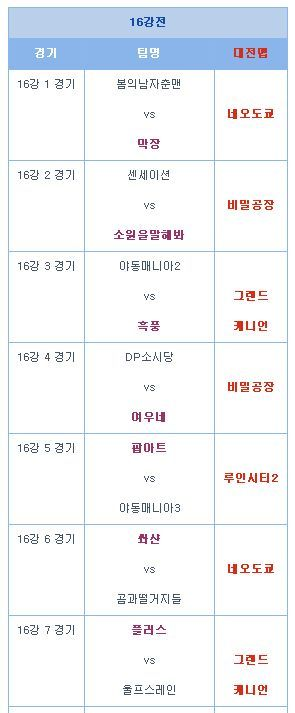

우릴 이긴 플러스가 4강까지 진출하긴했지만... 그걸로 위안은 안되더라.

사실 이번 킹클 준비하면서 여러 클랜과 클랜전을 했는데, Zeonic의 노멀한 조합 [톨삼, 앞사, 빠쿠, 지작] 에는 한계가 보였다.

막장을 비롯하여 놀랄 정도의 순줌을 보여준 몇몇 클랜의 경기를 보았을 때, 마탑, 건탱, 자멜, 어썰슈라 등 저격 유저가 클랜전에서 얼마나 큰 영향력을 가지고 있는지 알 수 있었다. (그럼 뭐해..? 난 빠기 유저이지만 저격을 못하는걸...?)

클랜전 얘기는 이정도로 마무리하고.... 요 근래 사용중인 유닛들에 대한 썰이나 풀어보겠다.

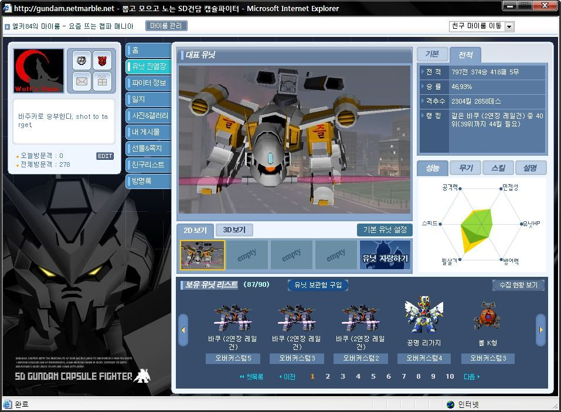

여러번 있어왔던 클랜전의 대부분을 함께 해온 내 빠쿠다. 유닛 보관함을 보시면 빠쿠가 셋인걸 아실 수 있을 것이다.

그 중 이 기체가 내 주력 빠쿠인 올필과 공으로 무장한 빠쿠이다. (나머지 두 기체는 올공과 올피다) 클랜전 패배를 함께 해온지라 승률이 낮지만, 2300여킬을 기록하며 39위권 진입을 눈앞에 두고 있다.

데메, 태그 매치, 일반 대전 등 어느 게임에서던 빠쿠를 했을 때의 승률이나 경기력은 월등하다.

허나 아쉬운 점은 빠기이면서 저격이 아닌 데미지 딜러라는 점인데 그걸 감안하고 선택한 기체인 만큼 애정은 식지 않고 있다.

내 언젠가 10위권 안에 빠쿠를 진입 시키리라!

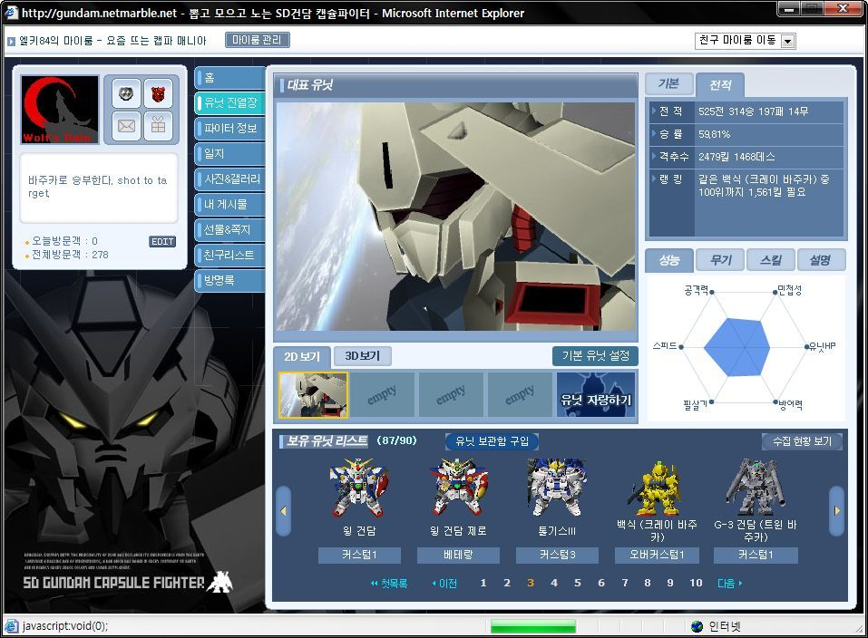
가장 애착이 컸고, 캡파에 재미를 붙이게 된 계기가 되었던 백식이다.

지난 2300여킬 포스팅 이후 100여킬 밖에 증가 안했다. 한마디로 거의 안썼다는 것. 승률이 꽤나 높은 유닛인데, 이유는 초보 서버에서 일반 대전에서 킬수를 올린 유닛이었고, 그 당시에는 최강급 유닛이었다는 점이 큰 작용을 했다.

백식 2번 리로드 상향이 없다면 나는 더이상 안쓸 생각이다. 노련한 레인져가 큰 메리트가 있던것도 옛날 얘기니...

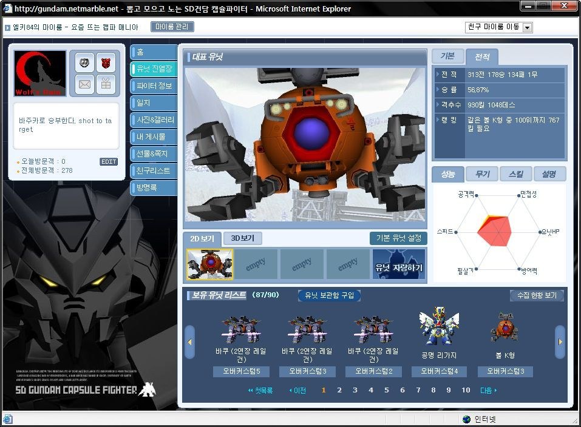
내 또다른 주력 기체인 볼K형이다. 내가 C랭을 좋아하는 이유는 4몫이기 때문에 공격적 성향을 띈 경기를 할 수 있기 때문이다. 다만....내가 볼K형으로 재미를 보는 상황은 주로 1:1 상황이 연출됐을 때 인데, 클랜전에선 그런 상황이 나오지 않는 다는 점이 아쉽다랄까? 

바주카와 많은 양의 부스터 등 사용하기 불편함이 없고, 3번 프리허그 역시 좋기 때문에 많은 유저들에게 인기를 끌고 있고, 나에게도 자주 선택 받는 개념기라고 할 수 있다.

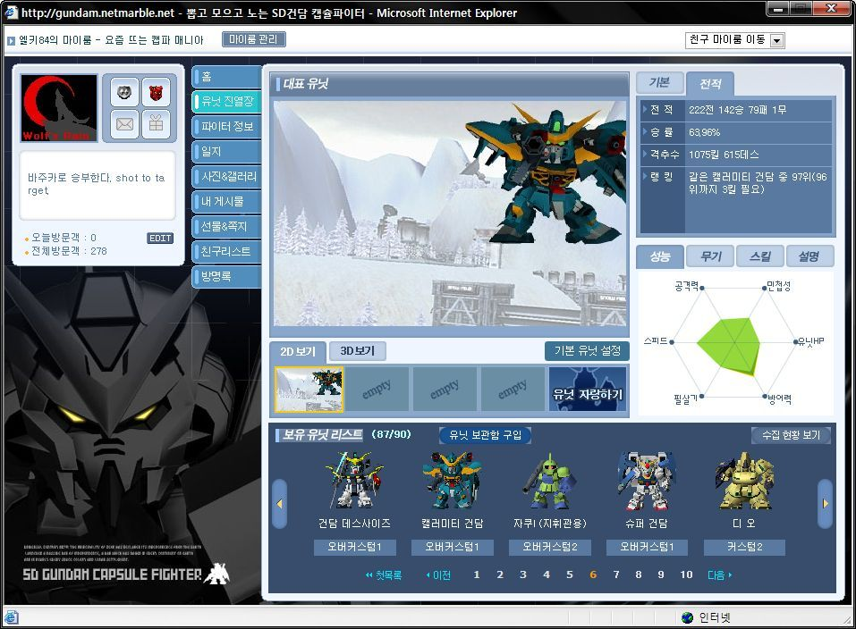
백식과 마찬가지로 한때 주력 기체였던 캘러미티 건담이다. 철벽에 페이즈 시프트 장갑은 탱커로써의 면모를 갖추었으면서도 괜찮은 기동성, 빔과 바주카를 한꺼번에 갖춘 개념기였기에 주로 사용했었는데, 전적이 표시되면서 승률을 보니 꽤나 높더라. 허나 그것도 옛말. 지금 쓰니 안습이더라. 역시나 봉인!

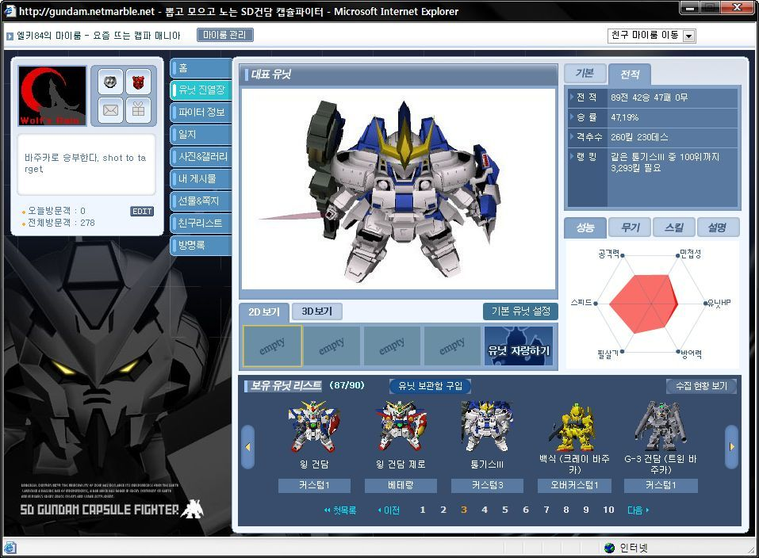
절대 주력기체가 아닌데 그냥 얘기좀 해야겠다.

난... 왜 톨삼이가 어렵지? 남이 쓸땐 그렇게 무섭더니 내가 쓰니 별로더라.

5월 이벤트때 커스텀 슬롯 3개짜리를 팔길래 캐쉬로 질렀거늘.... 이건 뭐란 말인가?

숙달 되면 좋을까 싶기도 했지만, 뭐 그럴 시간도 딱히 없고... 그래서 그냥 봉인!

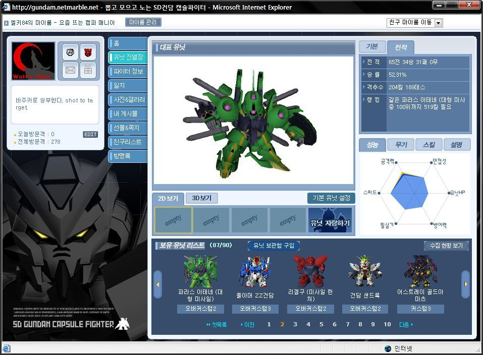
술먹고 친구네 집에서 일퀘 깨고 자려고 하다가, 뽑기 하니 툭 튀어나왔다.

스킬[저력, 돌격지휘]도 개념이고 리로드도 좋고, 호밍 미사일 속도도 워낙 좋아서 큰 인기를 얻고 있는 유닛이다.

사실 나는 그만큼 좋은지는 잘 모르겠다. 뽑고 싶어 난리가 났던 유닛도 아니고...

뭐 그냥 저냥 괜찮긴 하더라만....

클랜전에서도 한동안 매번 껴있더니 우리가 파라스 아테네로 준비하니 다시 톨삼,앞사 베이스의 노멀한 조합들로 바뀌었드라.

뭐 내가 잠깐 클전에서 파라스 아테네를 하기도 했는데, 나는 인파이터지 아웃복서 스타일이 아니다보니 금방 산화되더라. 쳇... 

뭐 사실 데메에서도 다운빔이 없어서 힘들기도 했고.... 후~ 묵기 따라다니면서 보조적인 성향으로 사용해야 되는 유닛이더라. 어쨋거나 돌격 지휘도 있으니~

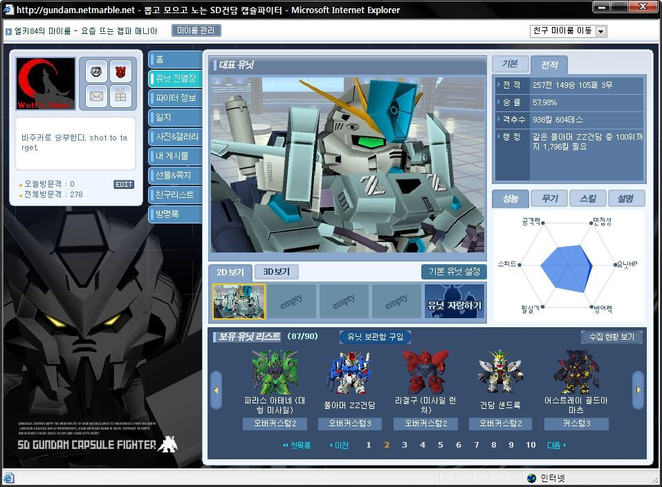
여기 나온 킬수는 1000킬 가까이 밖에 안되지만 실질적 킬수는 2000킬에 가까울꺼라 생각되는 풀아머 떱젯이다.

태그 매치에서 유닛을 키울땐 풀아머 떱젯과 같은 팀을 이뤄주면 승률이 어느정도 보장이 되기에 리더만 다른 유닛으로 지정해두고 풀아머 떱젯은 늘 껴주는 편이다.

맵도 가리지 않고, 스킬도 좋은 개념 유닛. 백식을 밀어내고 실질적인 고랭크에서의 내 주력기라고 할 수 있다.

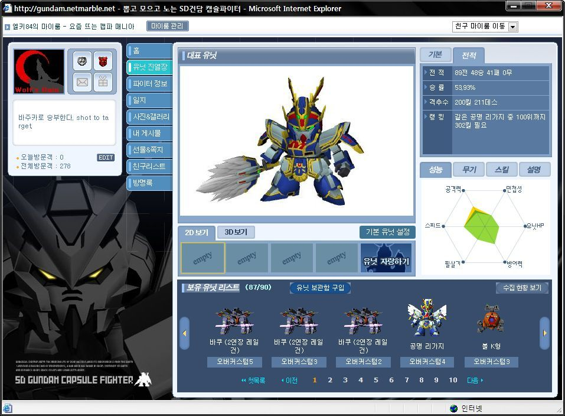
마지막으로 7월 킹클 준비용으로 구입한 공명 리가지다.

2번 미사일이 레일건과 비슷한 탄속이며, 3번 호밍이 리겔구 레어와 비슷한 궤도로 날라가는데, 3번 리로드가 꽤나 빠른 편이라 리겔구 레어보다 시원 시원하게 경기를 할 수 있다. 다만 2번 부채질의 리로드나 미사일 수가 좀 부족하다는 것이 아쉬울 뿐이다.

3번의 궤도가 워낙 좋은지라 장애물에 숨어있는 유닛을 끌어낼 때 유리하나... 클전에선 그런 상황이 잘 연출되지도 않더라. 사실 데메에서도 주력기로 삼기엔 뭔가 부족한 느낌이랄까?

클랜전 준비용이었다보니 오버4커까지 키우긴했지만... 내 스타일은 아니더라.

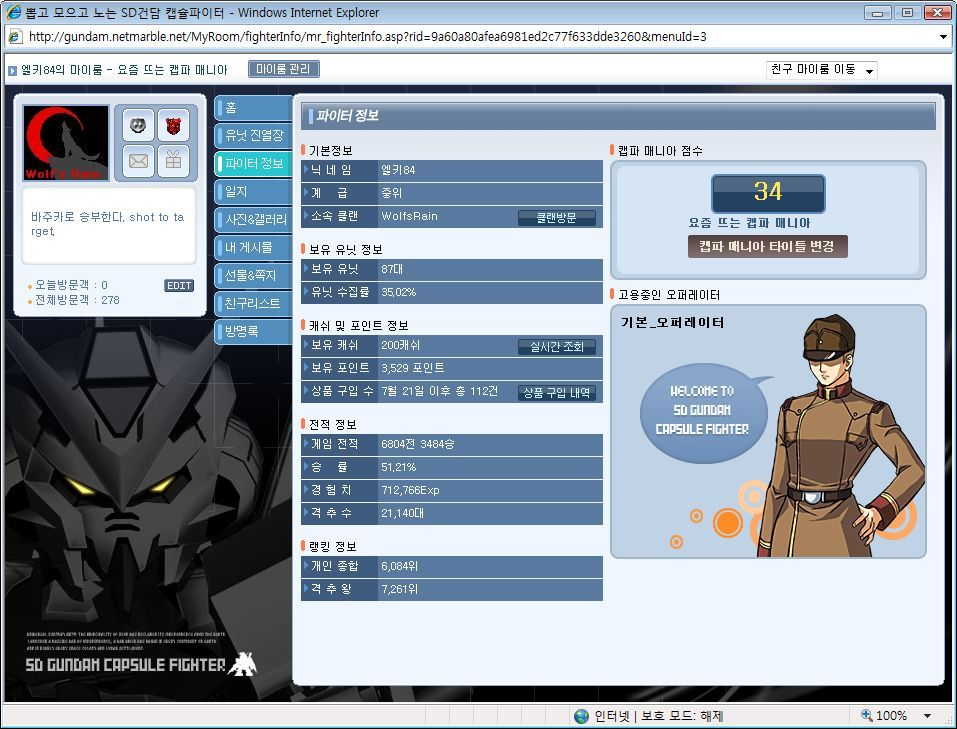

쓰는 기체 위주로 쓰니 승률이 유지가 되더라. 몇몇 기체가 깎아 먹긴 했지만서도...

특히 클랜전에서 많이 깎어먹었다만 데메나 태그 매치에서 많이 올렸다.

51.21%. 뭐 이정도면 승률은 만족한다.

클랜전에서의 부진이 빨리 끝나기만 바랄 뿐이다.

오버 커스텀 패치가 되고 접을까 고민도 많이 했지만... 한번의 오버 커스텀 하향 패치 이후 나름의 안정을 찾은 것 같다.

하지만, 순줌 패치가 되지 않는다면 여전히 스나 유닛의 강세는 계속되지 않을까 싶다.

뭐 손이 느려 스나를 하지 못하는 사람의 항변일지도 모르지만 스나 기체들은 조금은 더 하향이 되어야 하지 않을까?? 어디까지나 개인적인 의견이지만 말이다.
