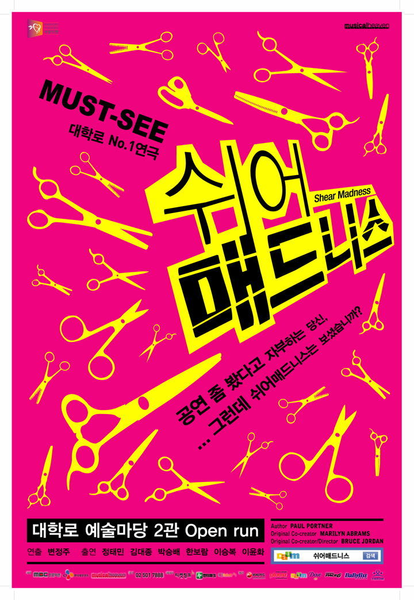

사실 이 공연을 고를 당시 처음 선택한 것은 순정만화였다.

강풀씨의 작품들을 워낙에 좋아하고, 개인적으로 멜로나 드라마 장르를 좋아하기 때문이다.

하지만 같이 보러가는 친구가 멜로를 좋아하질 않더라. 그래서 고르다 고른 작품이 바로 이 작품이었다.
미용실 살인극? 도대체 무슨 내용일까?

기대를 갖고 대학로로 나섰다.
근데....우선 극장찾기부터 헤멨다 -_-; 사실 내가 좀 길치다. (심한 수준)
대학로 예술 마당 2관이라....-_- 1시간정도 여유있게 약속시간을 잡았음에도 도착하고 나니 딱 3시였다. 공연이 시작하자마자 도착한지라 겨우 겨우 아무자리에 앉고 연극을 보기 시작했다.

극장 자체 규모는 이전에 본 연극들이 다 소극장인데에 반해 연극관 중엔 꽤 컸다. 

전반적으로 개그코드를 많이 담고 있다. 허나 기본적인 틀은 추리극. 살인극인줄 알았던 나로썬 낚였다고나 할까?
그런데 추리극도 나름 나쁘지 않았다.

사건을 보여준 뒤, 이 사건의 범인을 밝혀내는 과정에서 추리를 위한 힌트를 관객들에게 물어보는 식으로 극을 이끌어 나갔는데, 이런 관객 참여적인 요소가 연극의 묘미가 아닌가 싶다.

배우와 극장을 바꾸고 여전히 공연이 진행중이던데, 내가 추천해준 모두들 좋았다고 평가할만큼 대 다수가 공감할만큼 좋은 작품이란 생각이 든다. 강력 추천!