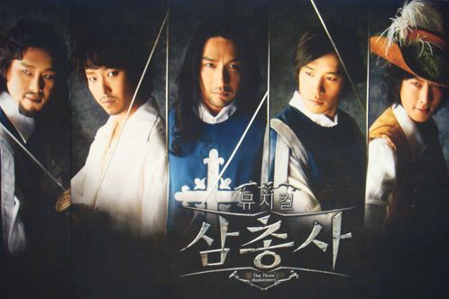

처음 본 뮤지컬이었다. TV에서만 가끔 보게되던 뮤지컬을, 연극에 이어 실제로 보니 그 감흥이 좋았다. 연극처럼 짧은 시간에 무대가 바뀌고 극이 진행된다는게 놀랍기도 했다. 스케일이 크고 음악이 좀 더 많이 활용되는 역시 Musical이라는 게 느껴졌다랄까?

6월 7일날 공연을 봤는데, 이 날 배우가 아토스 신성우, 달타냥 박건형이 출연한 날이었다.

개인적으로 신성우씨가 연기를 꽤 자주 했지만, 가수 이미지가 강해서 걱정을 좀 했는데 락커 출신이라 그런지 무게감 있는 목소리도 어울렸고, 외모상으로도 아토스 이미지에 적합하다는 생각이 들었다.

위치적으로 충무 아트홀이 참 애매한것이....주변에 제대로 된 커피숍이 없더라.

건물 내에 커피 파는 곳이 있긴한데 자리가 턱없이 부족했다.

하지만 첫 뮤지컬 치고 나쁘지 않았고, 연극과는 전혀 다른 즐거움을 가져다 준다는 것을 알았다는 것만으로도 좋은 경험이었단 생각이 드는 공연이었다.