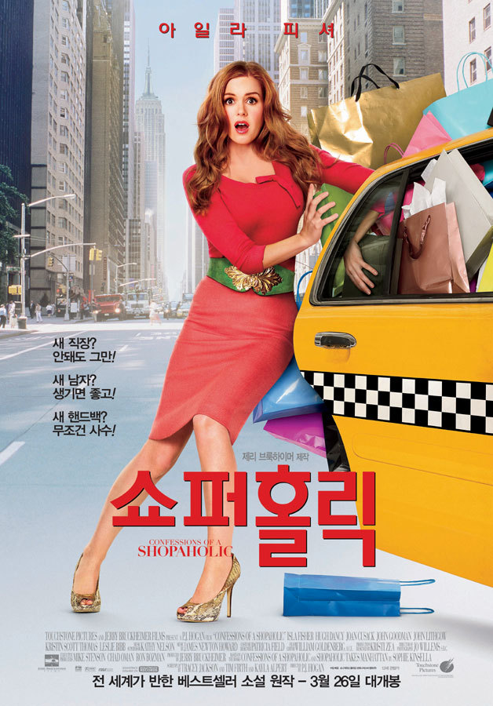

사실 내가 한 지름 하는지라....매우 궁금한 영화였다.

쇼퍼홀릭? 쇼핑 중독이 도대체 어느 수준이란 말인가?
 
쇼퍼 홀릭의 주인공 레베카는 그냥 중독 그 자체다. 모든 카드의 한도를 다 초과했음에도 불구하고, 사고 싶은건 어떻게든 사고야 마는 그녀다.

누구보다 쇼핑 중독이 심한 그녀가, 우연히 재테크 회사에 취직하며 벌어지는 에피소드를 그린 영화다.

더 좋은 옷, 더 좋은 스카프, 더 좋은 가방을 메야만 더 나은 사람이 된것처럼 느끼는 그녀의 모습에서 많은 것을 느낄 수 있었다.

쇼핑이란 것이 가져다 주는 즐거움은 너무나도 소모적이다. 하지만 그 즐거움이 생각보다 크기에 소모적인 즐거움을 위해 쇼핑을 하는 많은 쇼퍼들에게 조금이나마 경각심을 일깨워준 영화였단 생각이 든다.

하지만... 이 영화를 본지 몇달이 지난 난 아직 지름신에서 벗어나지 못하고 있다는게 씁쓸할 따름이다.