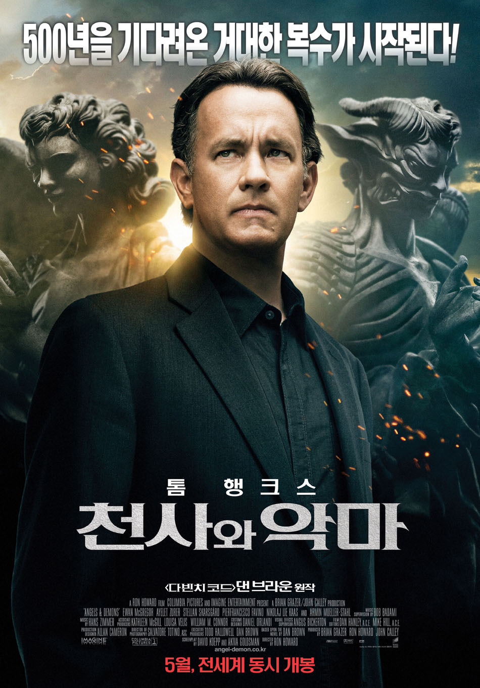

미리 밝혀두지만, 나는 교인이 아니다.
교회에 10년 조금 안되게 다녔었고, 세례도 받았지만.... 교인이 아니다.
그렇지만, 기독교의 역사는 유럽의 역사와 연관이 매우 큰지라 어느정도는 알고 있고 신교/구교의 구분 정도는 할 줄 안다.

천사와 악마라는 제목부터가 종교적인 성향을 많이 띄고 있을 것이라는 것을 짐작했다.
하지만....이 정도로 상상력을 발휘할 줄이야...!?!

교황이 죽고, 새 교황을 선출하는 과정에서 일루미나티라는 가톨릭에 핍박받은 단체의 복수극이 벌어진다.

일루미나티는 CERN이라는 신물질을 탈취한 후, 교황 후보 넷을 납치해 한시간에 한명씩 살해한 후, CERN을 이용해 바티칸을 폭파시키겠다고 위협한다.

로버트 랭던 (톰 행크스)는 바티칸의 요청을 받고,  이 사건을 해결하기 위해 나서며 이야기는 시작된다.
하지만 랭던은 한발씩 늦게 되면서, 교황 후보가 한명씩 죽어나가게 되고 이야기는 고조되간다.

계속되는 추적 끝에 한명의 교황 후보를 살리고 찾아나선 마지막 시간...허나 CERN을 너무 늦게 발견한 탓에, 바티칸이 폭파될 위험에 처한다.
하지만 그 위기의 순간 궁무처장(이완 맥그리거)가 헬기를 타고 올라가 공중에서 CERN을 폭파시키고 낙하해 모두를 살리 영웅이 되어, 영웅주의 적인 결말을 내는 듯 싶었다.

새 교황에도 나이도 어리고, 경험도 미천한 궁무처장이 임명 되는 전례없던 일이  벌어지기 직전.
이 모든일이 궁무처장이 킬러를 고용해, 일루미나티의 복수극인 것처럼 꾸몄다는 사실이 밝혀지고, 그는 자살을 선택한다.

사실 이때까지만해도, 교황 선출 위원장이 교황 자리에 욕심이 큰 나머지 궁무처장을 견제하는 줄로만 알고 있었다.
허나...그는 교황 자리를 탐낸 것이 아니라, 조금 고지식한 것 뿐이었더라.

이윽고 새 교황이 선출되고, 바티칸에는 평화가 찾아온다. 

과연 천사와 악마라는 제목이 가지는 의미는 무엇이었을까?
궁무처장이 천사가 되고 싶은 악마였단 의미였을까...? 아니면 누구나 천사가 될 수도, 악마가 될 수도 있으니 바른 길을 선택해야 된단 의미였을까?
어쨋거나 너무나도 현실적이었기에 씁쓸했지만 그만큼 여운이 많이 남는 좋은 영화였다.