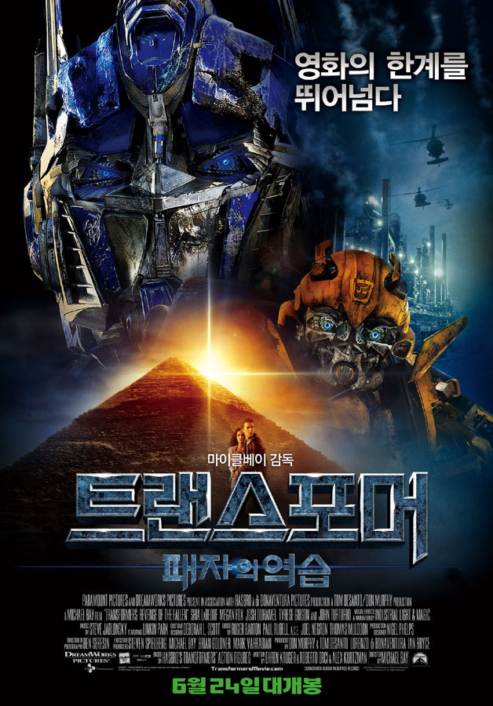

정말 오랜만에 심야영화를 보러 갔었다. 이 시기에 개봉한 영화가 `트랜스포머 : 패자의 역습`
전작을 워낙 재밌게 봤던지라, 큰 기대감을 갖게 보게 됐다.
전작이 워낙 비주얼적으로 충격적이었던 작품이었던지라, 비주얼적인 기대 역시 클 수 밖에 없었다.

내가 이 영화를 본 시기가 개봉하고 몇일이 지난 후라, 트랜스포머에 대한 여러 평들을 들었는데, 기대 이하라는 사람들이 꽤 많아서 조금 걱정을 한건 사실이다.

하지만...그런 우려는 기우였을 뿐인가보다.  
영화 전반적으로 뻔해보이는 스토리였지만, 액션 영화가 이정도 스토리면 됐지 뭐~

사실 개인적인 취향상 다이하드 시리즈와 같은 스토리를 조금 더 좋아하긴하지만, 스릴은 좀 덜해도 메가 트론들의 웅장한 모습을 보니 다 용서가 됐다.

초반에 옵티머스가 너무 쉽게 힘을 잃어, 아...이건 아닌데~ 싶은 생각이 들었는데...역시나 살아날 수단이 있더라.

우여곡절 끝에 옵티머스 프라임을 살려낸 후, 매우 오래되고 녹슬은 로봇과 옵티머스 프라임의 합체씬은 그야말로 압권이었다.

내가 전작을 본지 꽤 되서 기억이 안나는 건지 모르겠지만, 프라임이 여러명이고, 그 중 살아남은 유일한 프라임이 옵티머스 프라임이라는 것부터 시작해서, 트랜스포머의 세계관을 좀 더 폭 넓게 이해할 수 있는 계기가 되는 작품이란 점도 맘에 들었고 말이다.

국내에 번역된 만화책이 있는지 모르겠는데, 트랜스포머 애니메이션과 만화책도 찾아서 보고 싶은 생각이 들만큼 재밌게 본 작품이었다.