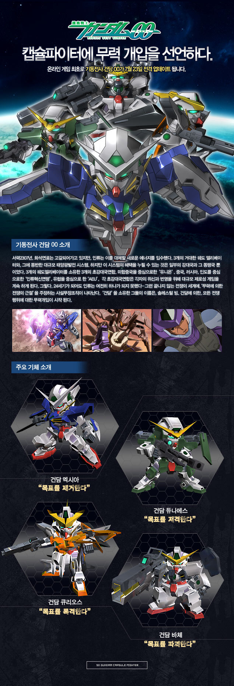
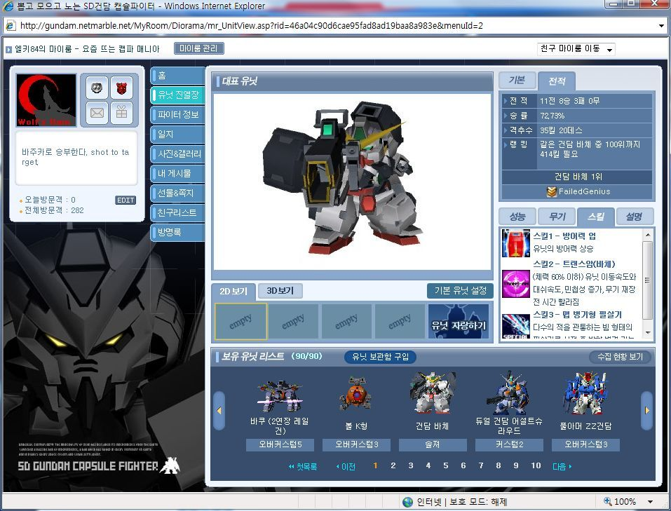
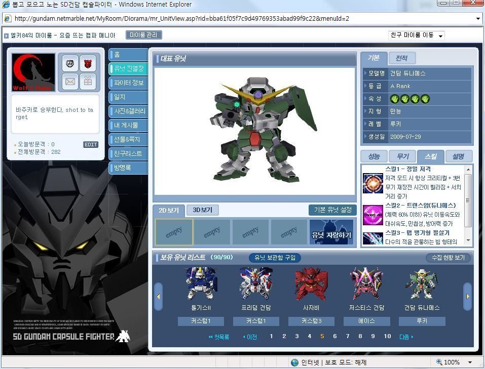
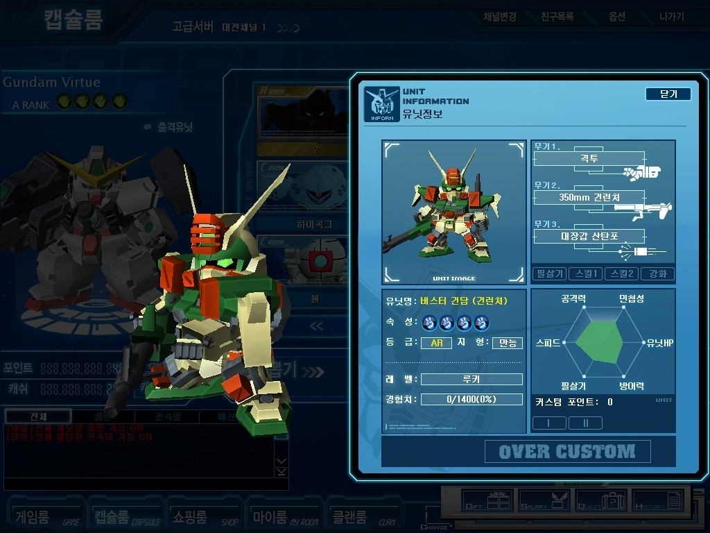
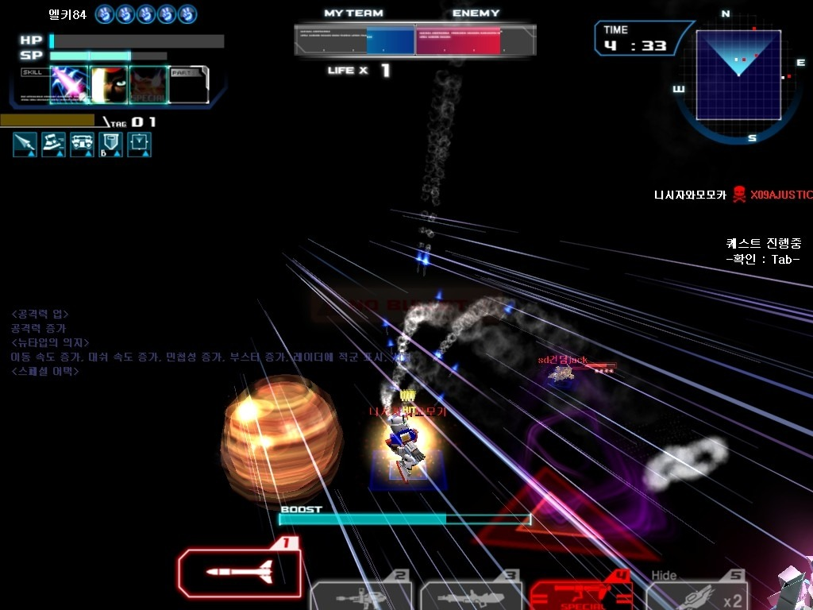
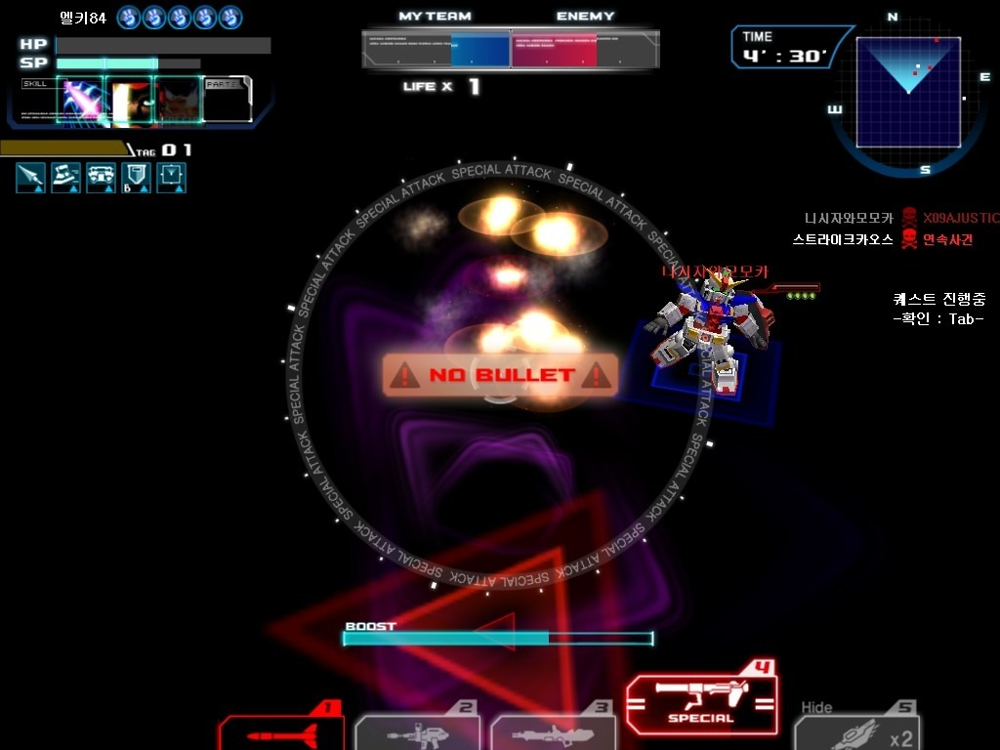

등장 유닛 라인업에 없던지라 아무 기대도 않던, OO(더블오) 계열이 캡파에 등장했다.

등장한 유닛은 엑시아, 바체, 큐리오스, 듀나메스 네기였다.

이 중에서 바체와 큐리오스가 개념기로써 인정받고 있는 상태다.

엑시아나, 듀나메스도 준수한 편이라 비난 받는 정돈 아니라고 하니, 더블오 계열은 어느 하나 저주 받은 기체는 등장하지 않은 것 같다.

이 업데이트와 함께 추가된 A랭 캡슐 머신에 포함된 기체는 데스 사이즈 헬과, 알트론인데 나는 이 6기중 어떠한 기체도 소유하고 있지 않아 뭐가 나와도 상관없었던 상황인지라 부담없이 질렀다.

그랬더니 튀어나온 것이 바로 바체~!

단번에 내 주력기중 하나로 등극한 바체.

1번 똥파워 단타에, 2번 반응 좋은 빔 바주카, 3번 똥파워 다운빔.

게다가 위급 상황에선 가변 키를 통한 나드레 출격도 가능하기에 매우 유용하다. (사실 나는 나드레보단 그냥 바체로 싸우는걸 선호한다만;;)

트랜스 암이 떴을 때 리로드 업 효과가 있기때문에, 그리 느리지 않는 리로드에 사실상 무한 탄환을 제공해준다.

기본적인 민첩성이 낮은 편이 아니기에 트랜스 암은 더더욱 효과적이라고 볼 수 있다.

듀나메스는 쫌 어정쩡하다...저격 기체에 트랜스 암이 그리 중요할까?;; 게다가 어썰 슈라가 있는데 굳이 듀나메스를 꺼낼까? 런쳐나 버스터도 봉인인판에;;

나쁘진 않지만 좋지도 않다는건 그냥 묻힌단 얘기다 -_-;

어썰 슈라의 괴랄한 조합 (빔 + 레일건)과 반대인 2번 미사일과, 3번 저격빔... 안습이다 -_-;

바체를 뽑고나서 남은 1600포인트로 질러서 나온 버스터 건 런쳐가 나왔다~!! 이런걸 보면 내 AR 뽑기 운은 꽤나 좋지 않나 싶다. AR 10기중 7기나 뽑았으니 말이다.

기본적으로 찌백식과 매우 흡사하지만, 3번 무기를 쓸때 자체 경직이 있단것과, 다른 스킬을 달고 있다는 점 정도가 차이라 볼 수 있다.

AR이지만, 사실 백식이 좀 더 좋기에 유용할지는 의문. (현재도 바체에 훨씬 우선순위를 두고 키우고 있다)

아래 스크린 샷은 버그 생겨서 망친 게임때 찍은 것들이다.

태그 매치였는데 세몫 다 날라가더라. 카메라 위치가 잘못된 상황으로 보여졌는데, 필살기도 카메라와 영향이 있는지 내가 분명히 한기를 맞췄음에도 실피였던 그 유닛이 죽지 않고 날 죽이더라 -_-;; 왜 그런 상황이 나왔는지도 알 수 없음;;

클랜전이나 킹클에서 튕기는 상황은 전보다 줄어든거 같은데... 화면 전환시 채팅 입력시 오류와, 이런 버그들좀 줄여줬음 좋겠다; 새로운 컨텐츠 추가도 중요하겠지만 안정성도 잡아야 하지 않겠는가??
