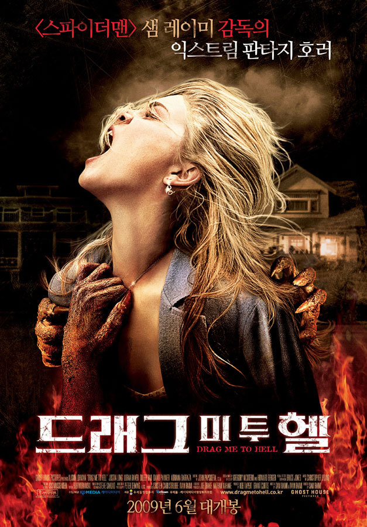

매년 한편씩은 보아온 공포영화.

올해 선정(?)한 공포 영화는 바로~!! 드래그 미 투 헬이었다.

이 영화에 대한 평가로, 코믹 스릴러라는 평이 많은데 그렇다고 가벼운 영화이냐? 그건 절대 아니다.

영화는 악마에 끌려간 꼬마 이야기로 부터 시작된다.

그리고 다시 현대로 시대가 바뀌고~!

주인공 크리스틴은 은행에서 열심히 일하지만 그다지 인정받지 못하는 시골 
태생 은행원이다.

대출 상담원이지만, 맺고 끊음이 확실치 못한 그녀는 갓들어온 동료에게마저 승진 경쟁에서 뒤쳐진다.

 
이렇게는 안되겠다는 생각에 독한 맘을 먹고 받은 첫 고객이, 바로 가누시 부인.

가진거라곤 집하나밖에 없는 딱한 처지의 부인이지만, 그녀의 각오는 단호해 대출을 거절하고...

대출을 거절하는 과정에서 망신 당한 가누시 부인은 크리스틴에게 저주를 내린다.

 
그 저주는 바로 '라미아의 저주'.
4일간 악마가 저주 받은 자를 쫓아 다닌 후, 그 자를 지옥으로 데려간다는 끔찍한 저주다.
그녀가 저주에서 벗어나려 애쓰는 과정이 영화의 주 내용이다.

진짜 저주가 걸린다면 그녀 처럼 될까...? 정성껏 기르던 고양이를 자기 손으로 죽일 만큼...?
만약 나도 사랑하는 사람이 저주에 걸려 이해 못할 행동을 했을 때 모든 걸 믿어주고 사랑할 수 있을까...?

영화 자체가 공포스럽다기보단 두려움에 사로잡힌 한 여인을 보며 공포를 느끼는 사람이 어찌되는가를 보여주었는데, 이런 점에서 다른 공포 영화와 또 다른 재미를 가져다 준 영화가 아니었나 싶다.