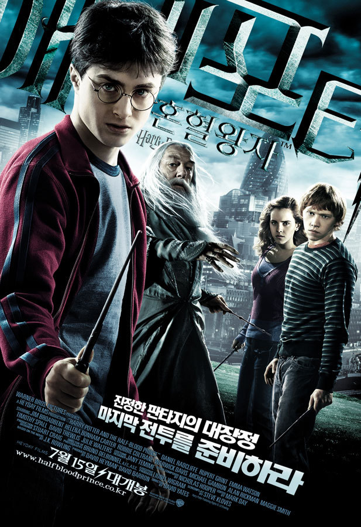

몇년만이지...? 하여간 굉장히 오랜만에 본 해리포터였다.
뭣보다 애덜이 왜 이리 큰겨? 헤르미온느는 잘 컸거늘.... 포터 ㅠ_ㅠ 넌 대체.... 

워낙 중간 중간 띄엄 띄엄 봐갖고, 론과 헤르미온느 사이의 러브라인이 언제 있었는지도 잘 모르겠고 -_-;
어쩌다 포터가 이렇게 컸고, 무슨 무슨 일들이 있었는지 추리를 하는 맛도 나름 괜찮았다.

볼드모트가 해리포터 부모님의 원수고, 그가 역사상 가장 사악한 마법사이기에 그를 없애야 한다
그렇기 위해선  7개로 나뉘어진 호크룩스를 파괴해야 하고, 그 힌트를 얻기 위해 슬러그 혼 교수를 초빙하면서 이야기는 시작됐다.

전반적으로 큰 이야기는 호크룩스를 파괴하기 위한 이야기였지만, 중간 중간 론의 러브스토리 (결국은 헤르미온느의 곁으로 돌아왔지만)와 쿼디치 게임도 나오더라.

그런데 뭐랄까...지금 북미 흥행 순위가 굉장히 높은걸로 아는데...그정돈 아니더라.

볼거리가 그렇게 많은 것도 아니었고, 스토리 진행이 굉장히 더뎠다. 혼혈왕자에 대한 궁금증을 한참 심어주고, 결국 그의 정체는 스네이프 교수? 이걸로 끝이라고?? -_- 

호크룩스 파괴를 위한 힌트를 얻기는 했지만 그 것이 어떻게 쓰일지는 다음편에서 보라는 건가? 그저 죽음의 성물편까지 스토리를 잇는 과정에 불과할 뿐이었을까...?

오랜만에 본 해리포터였지만  덤블무어가 죽는 과정도 좀 허무했고... 뭐랄까 전반적으로 좀 많이 아쉬웠다.

트랜스포머 스토리는 만족하면서 왜 해리포터는 아쉬워하냐고? 난 트랜스포머는 눈이 즐거운걸로 만족할 수 있지만, 해리포터는 스토리를 기대하는 작품이라서 그렇다랄까?

어쨋든... 죽음의 성물이 개봉한다면 또 다시 보러 가게 되겠지만....아쉬움이 남는건 어쩔 수 없나보다.