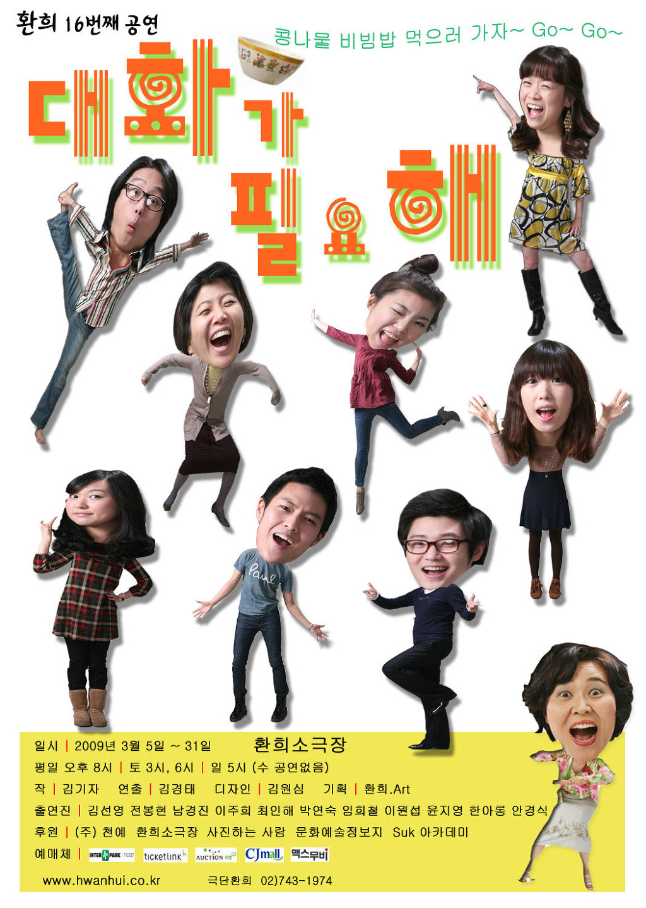

식탁도 하나, 메뉴도 하나. 콩나물 비빔밥만 전문으로 하는 어느 가게에서 벌어진 이야기를 다룬 작품이다.

가게 손님으로 등장하는 다양한 사람들의 살아가는 이야기를 보여주는 방식으로 진행 되었다.

발전이 없고 힘겨운 생활고에 지친 이혼을 앞둔 부부 이야기, 40대가 됐지만 꿈을 가지고 사는 이모, 누구보다 사랑하던 아들을 잃은 후 현실을 받아들이지 못하는 아버지와 그런 아버지에게 사랑받고 싶은 딸 이야기를 보여주었다.

여러 에피소드를 들려주는 것 자체는 좋았는데, 여운이 남았다기보다는 뭔가 뒷 이야기가 남은 것처럼 마무리가 덜된 느낌이 들었다.

이런 류의 살아가는 이야기를 풀어주는 에피소드형 연극이나 드라마, 만화를 좋아함에도 아쉬웠던 것은... 아무래도 시나리오의 완성도가 떨어졌고, 연기가 아쉬웠던 것이 겹친 거라고 생각한다.

연극이 지속되다 보면 조금 더 나아질 수도 있겠지만...누군가에게 쉽사리 추천하기 힘든 작품이었다.