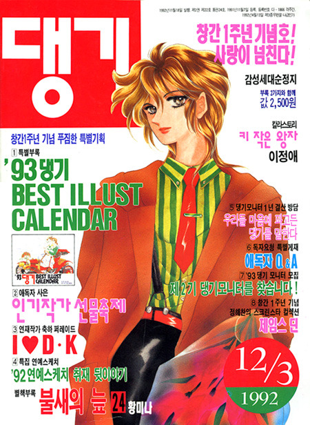

내가 만화를 접하는 경로는 주로 누나들이나 친구들이 보는 만화를 같이 보는 것이었다. 그 당시 만화들은 소녀지에서는 바람의 나라, 리니지 등이 연재 되던 시기였는데 레드문도 같은 시기에 연재되는 만화다보니 자연스레 접하게 됐었다.

당시 인기리에 연재되던 댕기다. 바람의 나라가 연재됐던 잡지였으나 90년대 중반에 폐간됐다.

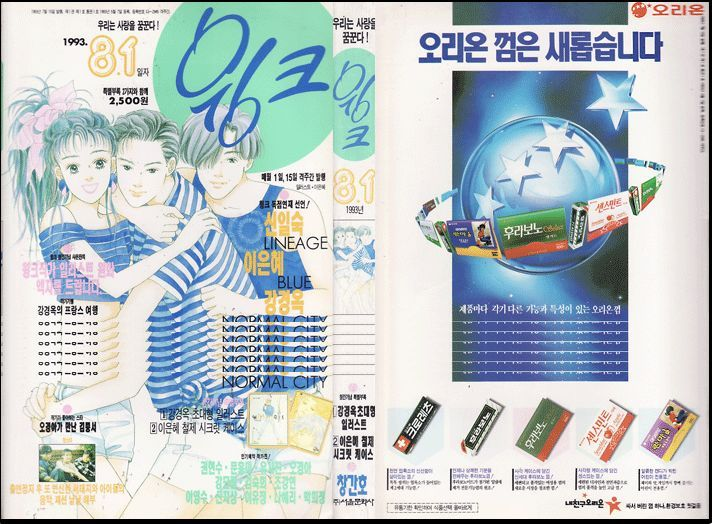

댕기보다 연재가 1년 반정도 늦었지만, 훨씬 오래가고 있는 윙크다.
인기 있던 순정 만화 대다수가 윙크에서 연재 됐고, 현재도 계속 출간되고 있을만큼 긴 인기를 누리고 있는 잡지라 할 수 있다.

누님들이 보던 순정만화를 같이 보던 내가 가장 좋아한 만화는 바로 레드문이었다.

 사실 초반부에는 그저 황당했었다.
이 작품 이전에 내가 본 황미나씨 작품은 슈퍼 트리오였기에, 너무 다른 분위기에 어색한 것도 있었고 말이다.

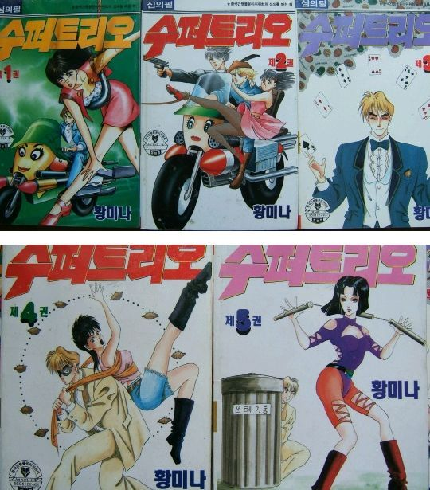

얼마전에 네이버 웹툰으로 연재되기도 했었으나, 아쉽게도 연재 중지 되었다.

슬램덩크의 서태웅의 사례처럼 주인공이 가장 인기 있으란 법은 없듯이, 이 작품에서 가장 인기가 많았던 인물은 사다드였다.

사다드는 단순한 수호기사로써 보여진 이미지 그 이상이었다.

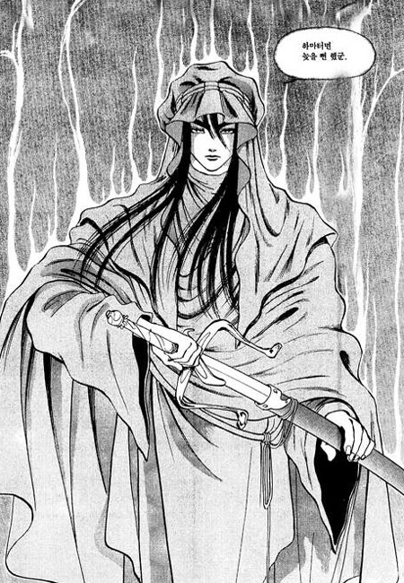

귀족의 자제이지만 반역자로 모함 받아 노예가 된 사다드에게, 자신을 향한 눈물을 흘려준 유일한 친구 필라르.
그런 꼬마 친구에게 지워진 태양이라는 짐을 덜어줄 수 없음에, 그의 영원한 친구이자 수호 기사가 되기로 결심한다.

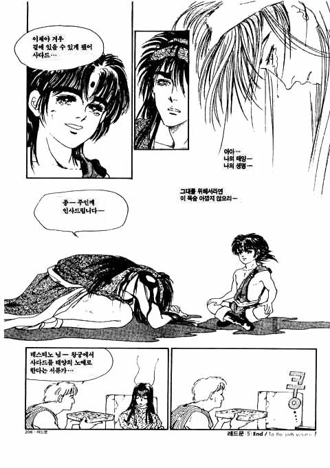
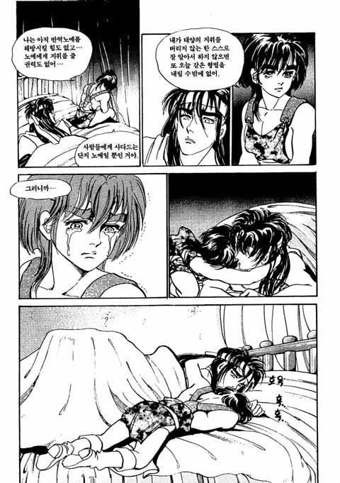

태양이란 지위로 인해 친구가 없던 필라르에게도, 사다드는 소중한 존재다.

사실 초반부는 좀 쌩뚱맞다. 갑자기 초능력이 오가고, 순간이동에, 염력에... 이건 뭔가 한참을 고민했다랄까?
좋지 않은 첫 이미지에도 불구하고, 이야기가 진행 될 수록 초반부 쌩뚱맞은 분위기를 납득 시켜주었다.

아즐라 일당이 왜 지구에 왔는지, 그들이 왜 윤태영을 노리는지 알 게 되면서 조금씩 작품에 몰입하게 됐다.

윤태영의 몸 속에 머나먼 시그너스의 전설의 태양 필라르가 숨어 있었던 것.

사다드는 그를 지키기 위해 그의 주변을 멤돈 것이고, 가짜 태양 아즐라는 필라르를 두려워 해 그의 약혼녀 루나 레나를 시켜 없애려 한 것이었다.
우여 곡절 끝에 윤태영은 자신이 필라르라는 것을 깨닳게 되고, 동생인 아즐라에게서 태양의 자리를 빼앗고 싶지 않아 지구인 윤태영으로 살아가고자 마음을 먹는다.

그런 그를 지구인으로 살아가게 둘 수 없던 아즐라는 윤태영의 가족을 시그너스로 납치하게 되고,
지구인으로 살아가기 위해 본래 자신의 육체까지 파괴했던 필라르는 시그너스로 향한다.

아그너스로 향한 후... 그가 죽은 줄만 알았던 루나레나는 정부에 대한 반군으로 활동하게 되며,
루나레나를 찾으려 천공도시에서 땅으로 내려온 아즐라는 결국 필라르를 만나 오랜 갈등을 풀게 된다.

아즐라가 필라르를 몰아내고 태양이 되었던 배후에는 아길라스가 있었다. 아즐라의 기억을 조작해 필라르와 자신이 형제였단 사실마저 잊게하고, 아즐라를 조종해왔으며 시그너스를 망가뜨린 아길라스를 용서 할 수 없는 그들은 결국 아길라스를 찾아간다.

하지만 다쳤던 아즐라에게 수혈했던 필라르에게선 이상 징후가 흐르고 있었다.
필라르의 검은 머리는 점점 하얘지고 아즐라의 흰머리가 까매지는 과정에서 정신능력도 필라르에게서 아즐라에게로 이동하고 있었다.

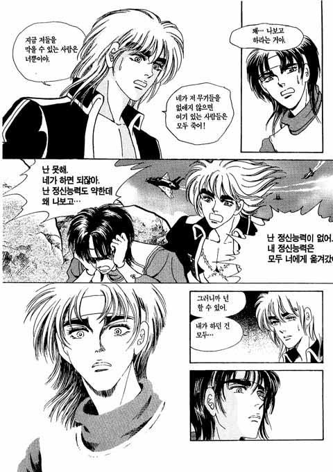

결국 아길라스를 쓰러뜨릴 수 있는건 아즐라 밖엔 없게 된다.

오랜 세뇌로 인한 공포심으로 아길라스를 두려워하는 아즐라이지만 필라르에게서 용기를 얻고,
아길라스의 세뇌에서 벗어난 아즐라는 아길라스를 없애는 데 성공한다.
하지만, 아길라스가 조종하던 천공의 도시가 추락하며 시그너스에는 종말의 기운이 멤돌게 된다.

 

그 순간 시그너스를 구한 것은 아즐라가 아닌, 정신 능력이 사라져 나약해진 필라르였다.

대부분의 영웅이 자신의 능력으로 많은걸 이뤄내는 강인함을 보이는 것에 비해서 필라르는 자신의 모든걸 바쳐서 구원한다.
이 모습을 보며 진정한 희생이 뭔지, 그가 왜 전설의 태양이자 구원자라 불리는지 알 수 있었다.

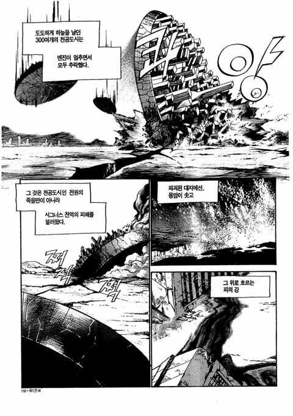
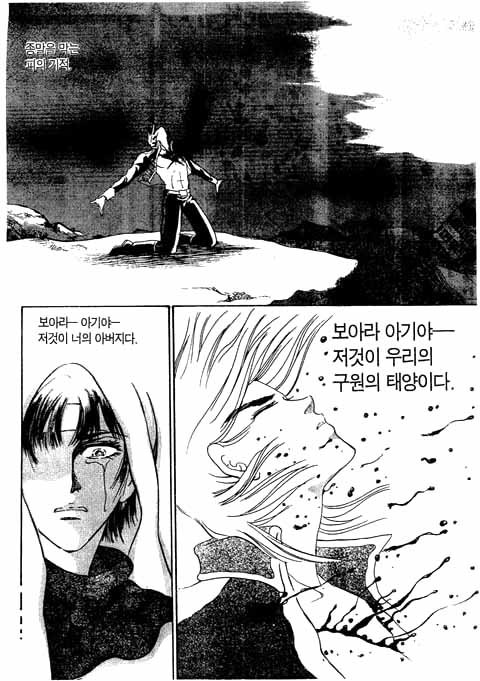

이 장면에서 몇번이나 눈물을 흘렸는데... 내가 보아오던 수 많은 만화와 게임에서의 영웅들과는 또 다른 의미로써 뇌리에 깊숙히, 또 감동을 줬기 때문일거다.
자신의 피로 시그너스를 구해낸 필라르는, 결국 기억도 잃고 신체능력도 거의 잃어버리게 된다.

시그너스도, 루나레나도 모두 아즐라에게 양보한 필라르가 안쓰럽기도 했지만...
그래서 레드문이 다른 작품들 보다 여운이 더 크게 남는게 아닐까하는 생각도 든다.

사다드와 함께 레드문에서 반드시 언급해야 할 인물이 또 있다.

히로인 루나 레나가 아즐라와 필라르 사이의 갈등의 요소였음과 동시에 갈등 해소의 매개체가 됐다면, 데스티노는 귀여운 악역이었다.

자신의 상관의 아내 아우렐리를 탐낸 나머지, 자신의 영웅 아우렐로를 반역자로 몰아 넣은 것도 모자라 사다드를 노예로 만든 원흉이지만, 그들의 침소로 찾아가 눈물을 흘리며 용서를 비는 모습에서, 탐욕에 의해 저지른 잘못에 후회하는 그가 조금은 안쓰러웠다.

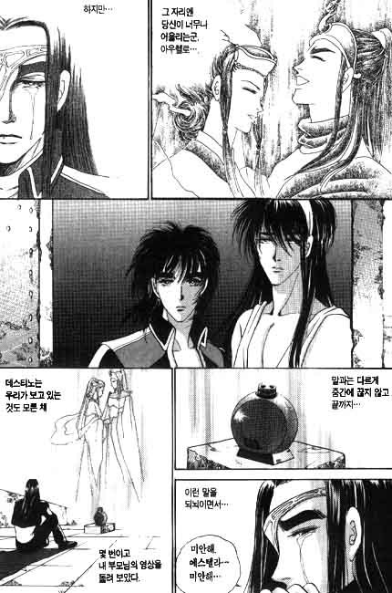

물론 간에 붙었다 쓸개에 붙었다하는 배신에, 아...어찌 저리 박쥐 같은 놈이 이렇게 오래 살아남을 수 있을까하는 궁금증을 자아낼 정도로 밉긴 했지만,
그 마저도 그의 역할이 극의 재미에 한몫 했다는 증거란 생각이 든다.

이 만화를 본지 십수년이 지난 지금도 늘 나에게 최고의 만화는 레드문이었다.
이 이상의 만화를 만나는 행운이 내게 올까? 

아니어도 좋다. 나에게 있어 레드문이 준 감동은 오래토록 기억될테니 말이다.

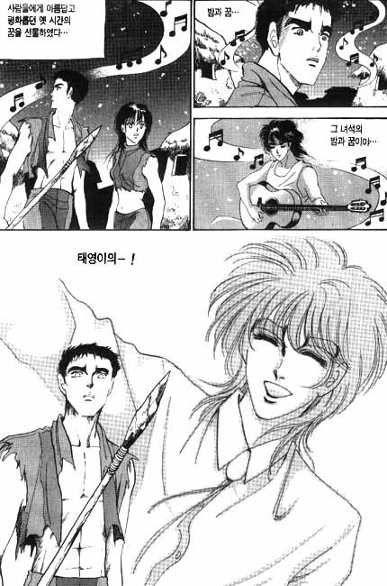

작은 바램이 있다면 레드문이 드라마화 되는 것이다. 그때면 밤과 꿈도 들어볼 수 있겠지...