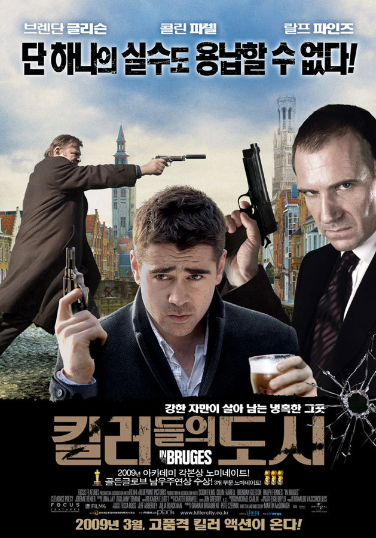

영화 자체가 좀 마이너한데다가, 제목부터가 킬러들의 도시라니; 왠지 잔인할거 같은 예감이 들어서 내가 직접 골랐다면 아마 보지 않았을 것이다.

우연한 계기에 보게된 영화가, 이렇게 깊게 기억될 줄이야?

 
대주교를 암살하고 영국에서 도망친 킬러 레이와 켄은 보스에게서 2주 동안 벨기에의 브뤼헤로 가라는 명령을 받는다.
영화에서 보여진 브뤼헤의 풍경은 내가 유럽 여행에 거쳐갈 나라중에 벨기에가 포함되게 됐을 정도로 아름다웠다.

브뤼헤에서의 휴식을 취하던 레이는 우연히 만난 한 여인과 사랑에 빠지고, 켄은 브뤼헤의 아름다움을 즐기며 평화로운 시간을 보낸다.

하지만....레이는 대주교 암살 도중 큰 실수를 저질렀었다. 바로, 꼬마 아이를 죽인 것. 킬러에게 절대 해선 안될 일. 여자와 아이는 해치지 않는다는 원칙을 어긴 레이는 반드시 죽어야만 되는 존재.

그를 없애라는 명령을 받은 켄과 레이 사이에서 벌어지는 이야기를 다루고 있다.
킬러들에게서도 규칙이 존재한다는 사실도 놀라웠지만, 그 원칙을 지켜나가는 과정은 꼭 중세의 기사도를 연상시킬만큼 인상적이었다.

하지만....그 원칙이란게 정말 그렇게 중요한걸까...?

킬러라는 직업 자체가 용서받기 힘든 존재지만.... 실수를 저지른 초보 킬러를 용서하고 새 삶을 살 수 있도록 도와주는 것. 원칙을 깨는 것이 그렇게 힘든 일일까?

나로썬 잘 이해가 안되지만....뭐 그들만의 세계가 있는 것이겠지.

무엇보다 브뤼헤의 아름다움만으로도 꼭 한번 봐야하는 영화로 꼽을 만한 멋진 영화였다.