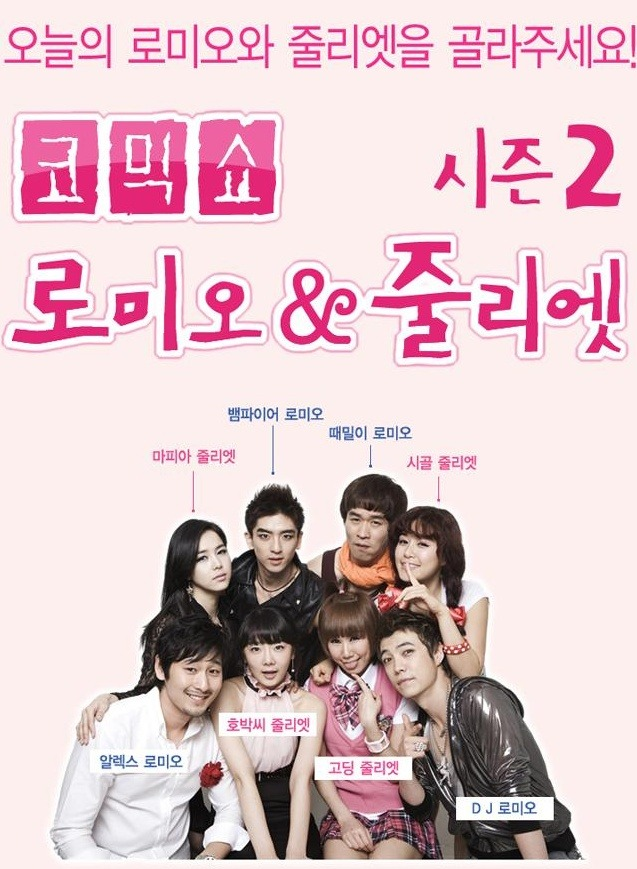

작년 빼빼로 데이에 보고 9개월여만에 본 로미오와 줄리엣 시즌2~!
지난번 시즌1도 너무나 재밌었던지라 이번에도 큰 기대감을 갖고 보게 됐다.
이 전날 무리를 해서, 저녁 늦게서야 집밖으로 나왔는데...날씨가 그리 덥지 않아서 그나마 다행이었다.

시즌 1과 기본적인 형식은 크게 변하지 않았더라고요. 하지만 캐릭터들이 바뀌어서 그런지 색다른 느낌으로 볼 수 있었다.

연극 컨셉 자체가 4명의 로미오와 4명의 줄리엣이 자신을 뽑아달라고 PR하는 과정 자체에서 오는 재미가 큰 작품이었다보니 관객에게 말을 거는 일이 많은데, 맨 앞자리에 앉았다보니 배우 분들이 말도 많이 걸어주시고~ 침도 튀고~~ 빵가루도 어찌나 튀기시는지~~~ 재미도 있었고, 컨셉인건 알지만 쪼금 더러웠다.

맨 앞자리였어서 직접적으로 빵가루가 튀겨서 더 와닿았던 느낌?

간만에 본 연극임에도 지루함 없이 많이 웃고 즐길 수 있는 좋은 연극이었다.