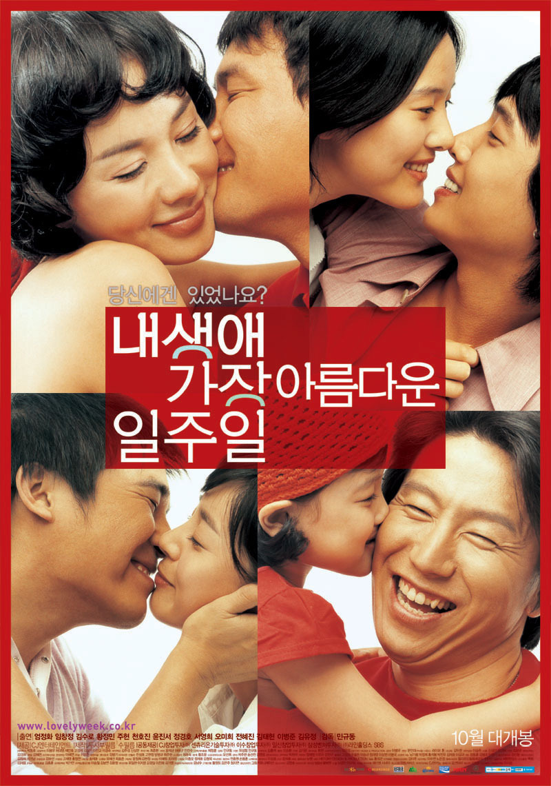

포스터에는 8명이지만, 실제로는 더 많은 사람들의 이야기를 다뤘다.

상영 시간은 2시간. 주어진 시간내에 얼마만큼이나 그 많은 사람들의 이야기를 전할수 있을까 싶었는데... 역시나 결과적으로, 장면 전환이 잦아서 몰입도가 너무 떨어진게 아닌가 싶다.

몰입도가 떨어지다보니, 이야기에 감정이입이 부족해, 다른 영화에서도 자주 느끼던 극도의 우연이 짜증스럽게 느껴지고, 감동스러워야만 할것 같은 장면이 감동스럽지 않았으니, 과연 이게 아름답다 말할수 있는가하는 생각만 들었다.

다른 옴니버스형 영화 (사랑해, 새드 무비 등...)도 많았지만, 내 생애 가장 아름다운 일주일은 시나리오가 조금 아쉬웠다.

옴니버스형 영화는 씬 전환이 잦고, 시간 배분이 적기 떄문에 시나리오의 중요성이 훨씬 더 큰데 이 부분에서 아쉬웠다는 생각이 드는 영화였다.