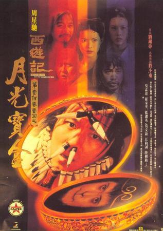
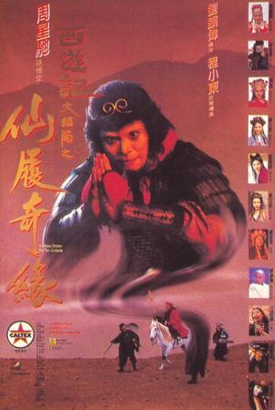
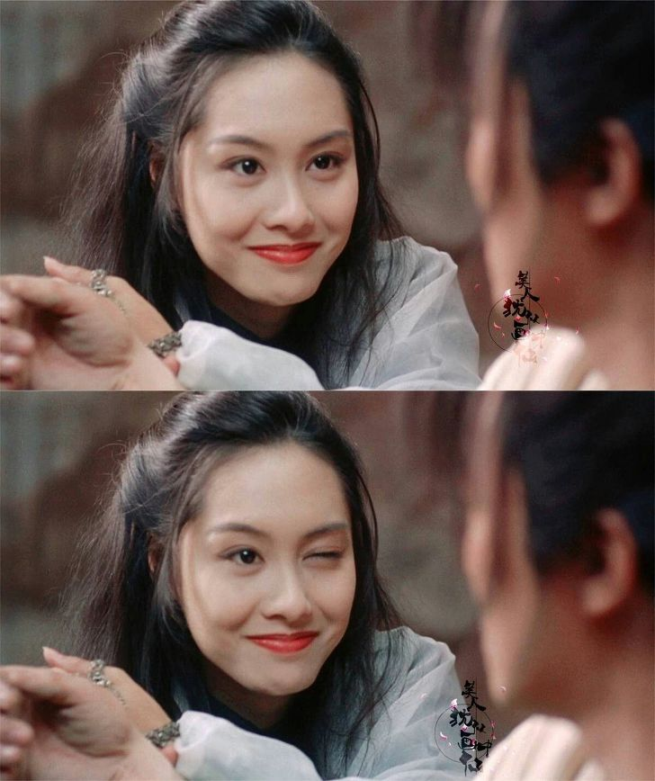
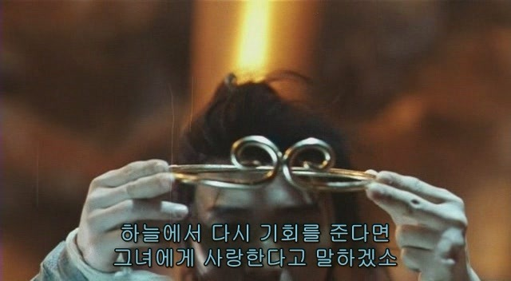
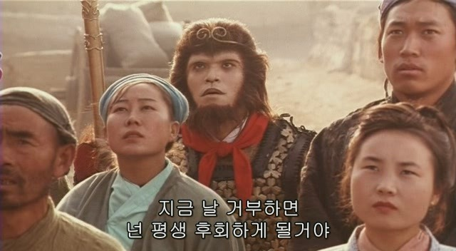
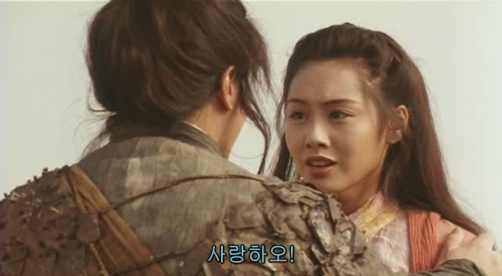

이 영화가 나온 시기에 난 초등학생이었는데, 영화가 15세 관람가였다보니…내가 이 영화를 극장에서 봤으리 만무하고…내가 이 영화를 접한 것은, 중학교때 특선 영화로써 접하게 됐었다.

두 편을 연달아 해줬다보니 월광보합, 선리기연 편으로 나누어져있다는 사실도 한참 후에야 알게 된 것은 물론이고.사실 지금도 난 외국 배우를 잘 외우지 못하는 편인데, 이 영화 전엔 주성치 영화를 본적도 없기에 주성치의 존재를 알리 만무했다.

선리기연 편은, 자하의 이야기로 부터 시작된다. 그녀는 본래 부처님을 지키는 여래 신등의 심지.

하지만 자신의 운명의 사랑을 찾으려 속세로 내려온다.

그녀의 운명은 자청 보검을 뽑는자. 그녀 이외에 그 검을 뽑는 자가 없었기에 속세에서 자신의 운명을 찾고자 한 것이다.

그녀의 매력적인 웃음은 중학생이던 내 맘을 흔들어놨고, 지금도 볼 때마다 감탄이 절로 나올정도로 아름답다.

---

월광보합을 사용해 500년 전으로 돌아간 지존보는 속세로 내려온 자하 선자를 만나게 된다. 주성치는 백정정을 찾아 다시 500년 후로 돌아가기 위해, 자하선사의 곁에 머물게 되고…. 그러던 중 그녀의 자청보검을 지존보가 뽑게 된다.

자하는 자청 보검을 뽑은 지존보를 자신의 운명의 짝으로 여겨 그에게 사랑 고백을 하지만…. 그는 이미 백정정과 결혼한 몸. 그렇기에 그녀의 마음을 받아들이지 못한다.

그 날 밤 지존보와 자하는 우마왕에게 끌려가고… 자하에게 반한 우마왕이 그녀에게 프로포즈를 하게 되고… 지존보에게 화가 났던 그녀는 마음에도 없는 우마왕과의 혼인을 약속한다.

그녀는 우마왕의 동생과 결혼 약속한 지존보를 죽이려하고, 그는 그녀에게 생애 최고의 거짓말이자 그녀를 감동시킬 거짓말을 하게 된다.

    사랑하오. 만약 기한을 정해야 한다면 만년으로 하겠소

이 거짓말로 위기를 모면하긴했지만, 최고의 거짓말이자, 그가 평생 후회하게 될 최악의 거짓말이다.그런 그녀를 그냥 둘 수 없던 지존보는 감옥에서 만난 삼장법사와, 그를 따라왔던 사오정, 저팔계와 함께 그녀를 구하고 탈출을 계획한다.

탈출을 감행하던 도중 우마왕의 아내인 우부인과, 우마왕의 동생은 우마왕에게 들키게 되, 탈출이 저지 된다.

상황이 여의치 않자 도망가던 지존보는 바닥으로 떨어지고, 다시 500년 후로 오게되었던 그 동굴로 돌아오게 된다.그리고 그 곳에서 자신이 정신을 잃은 사이 누구를 더 애타게 찾았는지 알 게 된다.

그리곤 자하 선자를 찾아온 백정정을 만나게 되지만, 백정정은 500년 후의 아내였던 자신보다 자하 선자를 더 사랑하게 되 버린 지존보의 마음을 알고 그를 떠난다.

한편 자하는 지존보에게 거미를 보내 자신을 구하러 와줄 것을 부탁한다. 그의 꿈속에 나타난 그녀는 이미 사랑을 위해 모든걸 다 바칠것이고, 그로 인해 받을 상처까지 각오했음을 표현한다.

사랑 하는 이를 위해 불나방이 될 수 있다면, 그 것만으로도 축복이라 생각한다.

그렇게 받는 상처마저 사랑한 기억이고, 그 마저도 행복한 기억이 될 것이기 때문이다.진정 불행한 건, 사랑하는 법도, 받는 법도 모르는 사람 아닐까?

자하를 사랑한단 사실을 인정할 수 없는 그.

그녀를 사랑하지 않는다고 변명해보지만 이미 그녀를 사랑하게 된 것을 어쩌겠는가? 미워하던 사람을 사랑하게 되면 더 간절히 사랑하게 될까?그건 아직 잘 모르겠지만, 확실한 건 사랑엔 이유가 없다.

사랑엔 이유가 없다. 결국 자하를 구하기 위해 손오공이 되기로 결심하지만, 손오공이 된다면 불경을 구하기 위해 속세와 연을 끊어야만 하기에 고민하지만, 그 방법 외에는 그녀를 구할 방도가 없기에, 손오공이 되기로 결심한다.

진심에서 우러난 맹세. 이렇게라도, 뒤늦게라도 그녀를 속이고 상처준 것을 속죄하려 하는 지존보.그리곤 우마왕에게서 그녀를 구해내기 위해 나서게 되고, 자하는 손오공으로 변한 그를 단번에 알아보고 기쁜 마음에 그에게 달라가지만, 그는 그녀를 외면한다.하지만 결국엔 지존보가 손오공이라는 것을 알아채고… 우마왕이 찌른 창에 그를 대신해 찔려 죽게된다.

    내 낭군은 영웅 중의 영웅이고
    언젠가는 구름을 타고 날 데리러 올 거라네

    난 첫 부분은 맞췄지만 
    마지막은 맞추지 못했어..

속세와 얽매여선 안되는 손오공은 죽어가는 그녀를 끝까지 붙잡지도 못한채 그녀를 떠내보내게 된다.

그녀를 잃은 고통을, 그 울분을 우마왕에게 쏟아내, 우마왕을 쓰러뜨리는 데에 성공한다. 하지만 이미 성은 태양 근처에 다 다다른 상황. 월광보합을 사용하여 다른 시대로 이동해 살아남게 된다.

그 곳에서 손오공은 자신의 옛 모습과 자하선사를 그대로 빼닮은 연인을 발견하게 되고…석양 무사인 남자는 그녀를 사랑하면서도 연인이 있기에 그녀의 마음을 받아줄 수 없다며 외면하려는 장면을 목격한다.

    내겐 사랑하는 사람이 있으니 보내주시오

    하지만 입맞춤을 하고 가라
    지금 날 거부하면 넌 평생 후회하게 될거야

그 모습을 보며 자하를 사랑하면서도 사랑한다 하지 못했던 지난 날 자신이 떠올리고…

보다 못한 그는, 석양 무사의 몸속에 들어가 그녀에게 입맞춤 한 뒤 사랑 고백을 하게 되고, 석양 무사와 그녀의 사랑을 이뤄지게 만드는 데에 성공한다.

    평생 떠나지 않겠소
    
    사랑하오!

지존보도 이 말을, 자하에게 할 수 있었다면 얼마나 좋았을까…? 그렇게 하지 못했음을… 두번 다시 그런 기회가 오지 않을 것임이 얼마나 안타까울까..?

석양 무사의 사랑을 이뤄준 뒤, 손오공과 삼장법사 일행과 불경을 찾으러 떠나며 영화는 막을 내린다.

자하와 이루어지지 못한 것은 너무나도 슬프지만, 이뤄지지 못하는 사랑이 너무나 많음을…그렇기에 후회 없는 사랑을 하길 바란다는 의도에서 이런 결말을 보여준 것일까…? 

이따금…아니 자주 이 영화는 내 기억에 남아 추억되곤 한다.

그 어린 나이에도 이 영화를 보면서 다짐을 했던 기억이 난다.

내가 사랑을 한다면… 반드시… 후회없는 사랑을 하겠다고…. 내 마음 모두 줘도 아깝지 않을 사랑을 하겠다고.

물론 그 다짐을 잊은채 누군가를 만났던 적도 있지만… 그건 아마 사랑이 아니었기 때문일 것이다.

내 인생 단 한번 찾아올 운명의 사람에겐… 모두 다 주고 싶다.

모두 다 줄 수 있던 사랑은, 모든 걸 다 준 사람은 후회가 없을 것이기 때문이다.