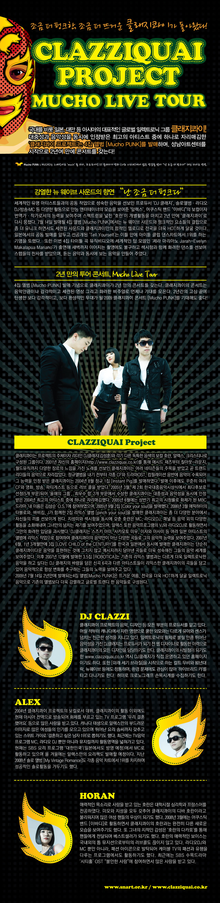

내가 클래지콰이 노래를 접한 시기는 1집이 발매되던 2004년으로 기억한다. 그때쯤 학교를 휴학했던 시기였는데, 그럼에도 불구하고 심리적으로는 무척이나 안정된 시기였고 많은 점에서 나에게 도움이 된 시기가 아니었나 싶다.

그 당시 클래지콰이와, 원티드의 1집이 비슷한 시기에 발매됐었는데, 그래서 두 앨범을 같은 시기에 들었던 기억이 난다.

원티드 앨범에서는 '발작', '어떻게 널 막겠니', 'Bye Bye Bye', 'Moonlight' 등 명곡이 많았지만, 단연 '나는'이 최고였다. 이 노래는 굉장히 슬픈 이별 노래인데, 이 시기에 실연을 한게 아니었음에도....그런거랑 상관없이 그냥 노래가 좋았다.

클래지콰이 앨범에서는 'Gentle Rain', 'Novabossa', 'Sweety', '내게로 와' 등...좋은 곡들 투성이였는데 그 중에서도 단연 'After Love'가 최고였다. 그냥 그해 여름이 별 이유없이 내 기분이 센치했었기 때문인지도 모르겠지만 그 해는 유난히 슬픈 노래에 많이 꽂혔었다.

그래도 그 중에서 우선 순위를 정하자면, 'After Love'를 좀 더 좋아했다. 사실 더 슬프고 애절했던건 '나는' 이었음에도 불구하고, 'After Love'에서 들려오는 알렉스와 호란의 목소리는 내 감성을 자극했었다.

어쨋거나, 그 때 이후로 클래지콰이 음반이 발매될 때마다 찾아서 듣게 됐는데, 2집부터 가장 최근 발매된 4집까지 이어질 수록 조금씩 더 하드해지는 거 같아 아쉬운감이 있긴하지만, 1집 당시 좋아했던 느낌을 살릴 수 있는 곡들도 여전히 남아있어 클래지콰이의 음악을 기대하게 만드는 것 같다.

어쨋거나 이번 앨범 발매 콘서트가 있다는 소식을 접하고, 바로 예매에 들어갔다.
역시나 중앙자리가 인기가 많더라만~ 나는 조금 사이드더라도 앞자리가 좋았으니 6열 9번~10번 좌석으로 예매하고 콘서트를 기다려왔다.

바로 어제! 8월 22일! 대망의 콘서트 날이었다. 큰 기대를 갖고, 찾아간 성남 아트센터. 처음 가보는지라, 앙상블 시어터로 찾아들어갔다가 여기가 아닌거 같아, 나와서 다시 오페라 하우스로 찾아갔다.

역시나...6열은 매우 가까웠고, 우선 자리에서 만족!
들어가서 조금 기다리니 콘서트가 시작됐다.

첫 곡이 'Kiss Kiss Kiss'였는데, 이 곡 이후에도 전반적으로 초반엔 하드한 곡 위주였다. 그래서 쫌 애매했는데, 'Tell Yourself'와 'Love Ends' 초반에 나온 곡들 중에선 가장 내 취향에 맞았다.

아무래도 초반엔 신곡들 소개와 비슷한 느낌으로 진행하려는 거였나보다.

여러 곡이 나오다가 중반부쯤 되니 라디오 처럼 즉석 진행을 하면서 신청곡을 받는 '척'하면서 진행하는 순서가 있었다.
그런데...내가 좋아하는 곡들을 무더기로 짧게 끝내다니...!! 특히나 'After Love'는 너무나 짧았다고요!!!!

라디오 방식의 진행 자체는 좋았지만, 너무나 짧아서 아쉬움이 좀 남았다.
물론 진행 방식 자체는 아주 맘에 들었으니~ 전체적으로 소프트한 노래들 위주로 처음부터 끝까지 진행되는 콘서트도 어땠을까 싶은 생각도 들었다.

미치도록 달리자고 하신 후반부에는 역시나 조금 가볍고 신나는 노래 위주로 많이 불러주셨다.
'내게로 와', 'Stepping Out', 'Fill this night', 'Be my love', 'Lover boy', 'Sweety'. 다들 신나는 노래라 좋긴했는데...나는 분위기 있는 노래들도 원했는데... 주구장창 원했던 'After Love', 'Speechless', 'Prayers' 와 같은 곡들도 들었으면 더 좋았을텐데 하는 아쉬움이 조금 남았다.

어쨋거나 나는 꽤나 신나게 놀았고, 꼭 콘서트 가보고 싶은 가수 목록에서 클래지콰이는 체크를 할 수 있다는 걸로 만족한다.
그리고...하루가 지난 오늘... 언제나 콘서트 다녀오면 생기는 증상....클래지콰이 노래에 꽂혔다! 물론 원래 자주 듣긴했지만...몇몇 곡은 그리 안좋아했는데 공연장에서 듣고 꽂혔으니... 한동안은 듣고 싶은 노래 찾을 필요 없겠군~

다음번 콘서트는 김동률씨 콘서트에 가보고 싶다. 이은미씨 콘서트도 좋고~!
해체는 아니라고 하지만, 활동은 근 몇년간 하지 않을 가능성이 농후한 롤러코스터 콘서트도 언젠간 꼭 보고 싶다. 롤러코스터 제발 돌아와요...!!!