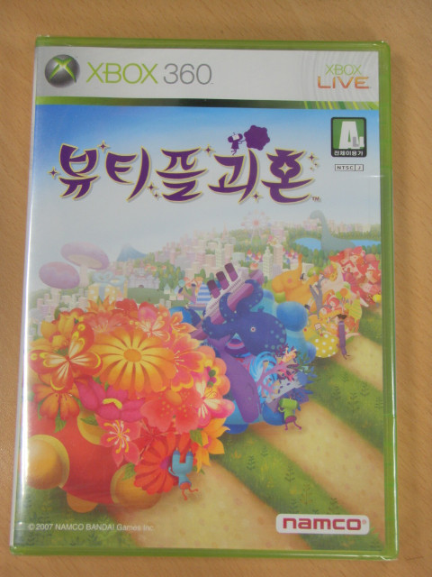

ps2용 괴혼은 잠깐 즐겨본 수준이고, 엔딩까지 본건 psp용 아바마마 오셨다 어서 굴려라가 다인 나였지만, 괴혼의 매력은 잘 알고 있는지라 뷰티플 괴혼의 구입을 망설이지 않았다.

지금은 ps3용 영문판 괴혼인 괴혼 Forever가 발매됐으나, 이 작품 구입 당시엔 일본어판 괴혼 Tribute만 나와있던 상태라, 전혀 읽지 못하는 일본어판을 원치않는 나로썬 덤핑으로 풀려 가격도 저렴한 뷰티플 괴혼의 구입이 적절했다고 볼 수 있었다.

psp판과 진행 방식은 크게 다르지 않은데, 온도를 높여주는 물건만 집어삼켜 10000도를 달성해야 되는 스테이지가 가장 재밌었다.

마지막 스테이지는 지구에서 10000km만큼 크게 만들고, 우주 탐험 모드에서는 블랙홀 구멍을 막아야 되는데, 너무 작을때 블랙홀에게 다가가면 안되는것을 몰라 한번 죽고, 두번째 했을땐 피해다니면 이기는줄 알았다가 타임오버... 아바마마의 설명을 듣지 않고 플레이했다가 15분 + 2분 짜리 스테이지라 긴데 시간 낭비가 됐고, 다시금 설명을 정독하고 클리어할 수 있었다.

클리어하고나면 특전으로 미니게임을 즐길 수 있게 제공해주는데, 횡스크롤로 괴혼 + 슈팅게임이 스탭롤이 올라가는 시간동안 제공된다. 처음엔 세이브를 해야 되기에 시간 떼울려고 했는데 하다보니 은근히 재밌었다.

목적성이 없다는 점이 몰입도를 떨어뜨리는 요인이 되긴했지만, 전체적인 재미면에서 나쁘지 않았다.

다만 볼륨이 너무 작다. DLC 포함해도 볼륨이 작다.

클리어는 했지만 빠른 진행에 우선 순위를 두는 스타일인지라, 숨겨진 선물이나 왕자의 친구들은 많이 못얻었는데 짬날때마다 다시 도전해봐야겠다.